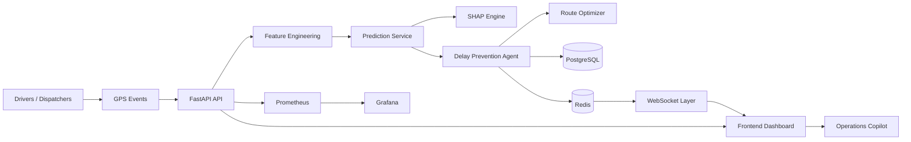

# IntelliLog AI Project Audit

**Audit Scope:** backend, frontend, ML pipeline, agent layer, optimization layer, database, Redis, WebSockets, observability, testing, deployment.

**Method:** repository inspection only. Conclusions below are based on code and checked-in artifacts in this workspace, not on assumptions or marketing claims.

**Assessment style:** statuses use three buckets only:
- ✅ Complete
- ⚠ Partial
- ❌ Missing

## 1. Executive Summary

**Project Name:** IntelliLog AI

**Project Purpose:** AI-powered logistics intelligence platform for predictive delivery operations, real-time fleet visibility, explainable risk scoring, delay prevention, and route optimization.

**Current Status:** substantial end-to-end system exists, but several production-critical paths still rely on placeholders, example data, or local-only fallbacks. The project is functionally strong, but not fully complete as a production system.

**Audit Scores:**

| Metric | Assessment |
| --- | --- |
| Project Completion | 81% |
| Production Readiness | 74% |
| Testing Maturity | 77% |
| Deployment Readiness | 76% |

**Bottom line:** IntelliLog AI is real software, not a scaffold. The core product loop is implemented across API, ML, agent, optimization, Redis, WebSockets, and frontend. However, multiple surfaces still return example data, some auth and deployment pieces are not fully production-hardened, and the copilot path is incomplete on the backend.

## 2. Problem Statement

IntelliLog AI exists to move logistics from reactive exception handling to predictive intervention.

The codebase is designed to address these operational problems:
- Delivery delays discovered too late to prevent SLA misses.
- Route inefficiency that wastes time and fuel.
- Poor fleet visibility across active deliveries.
- Manual dispatch decisions that do not scale.
- Weak explainability when operators need to understand why a shipment is at risk.

Expected business value:
- Higher on-time delivery performance.
- Lower support and escalation volume.
- Better route utilization and faster recovery from disruptions.
- Real-time operational awareness for dispatchers and managers.
- More consistent intervention decisions through AI assistance.

Expected users:
- Logistics operations teams.
- Dispatchers and fleet managers.
- Customer operations teams.
- Executives reviewing service performance.
- ML and platform engineers maintaining the system.

Expected outcomes:
- Live fleet monitoring.
- Delay risk prediction before SLA breach.
- Explainable risk drivers.
- Automated or assisted reroute decisions.
- Real-time notifications and dashboard updates.

## 3. System Overview

The repository contains a multi-layer architecture that is broadly coherent:
- FastAPI provides the backend HTTP and WebSocket surface.
- PostgreSQL stores tenants, drivers, orders, GPS events, agent decisions, route plans, and predictions.
- Redis is used for state, streams, pub/sub, and live caching.
- The ML layer loads pre-trained model artifacts and generates SHAP explanations.
- The agent layer uses LangGraph-style flow control to decide whether to alert, reroute, or do nothing.
- The frontend is a React application with a command-center style dashboard, Leaflet map, copilot panel, order views, and intelligence panels.
- Docker Compose and Nginx are used for deployment packaging and reverse proxying.
- Prometheus and Grafana are included for observability.

### Architecture Assessment
- The architecture is enterprise-shaped and internally consistent.
- The repository has clear separation between runtime layers.
- The biggest architectural gap is that some API surfaces still return example data instead of live database-backed records.

## 4. Backend Audit

### FastAPI App
**Status:** ✅ Mostly complete

Evidence:
- `src/api/main.py` wires the app, middleware, CORS, routers, `/metrics`, and startup/shutdown lifecycle.
- `src/api/routers/health.py` provides health, live, and ready endpoints.
- `src/core/metrics.py` exposes Prometheus metrics.

Assessment:
- The app structure is production-shaped.
- Request ID, timing, and tenant middleware are present.
- Startup loads model artifacts and verifies Redis/DB when external checks are enabled.
- The backend is not fully hardened because some dependencies are still resolved through local defaults and example data.

### Routers
**Status:** ⚠ Partial

Implemented routers:
- `auth`
- `health`
- `insights`
- `orders`
- `predictions`
- `routes`
- `agent`
- `drivers`
- `websocket`

What works:
- Auth login and current-user lookup exist.
- Order creation, listing, single order lookup, and position updates exist.
- Prediction and SHAP response path exists.
- Route optimization submission and polling exist.
- Decision history and decision detail endpoints exist.
- WebSocket endpoint exists for real-time tenant updates.

What is partial:
- `src/api/routers/insights.py` returns baseline/default KPI values rather than live analytics.
- `src/api/routers/drivers.py` returns example driver records.
- `src/api/routers/agent.py` returns example decisions.
- `src/api/routers/routes.py` returns example route results and hardcoded stop coordinates in current-route paths.
- There is no backend `/copilot/query` router even though the frontend client calls it.

### Services
**Status:** ⚠ Partial

Evidence:
- `src/api/deps.py` wires DB, Redis, prediction service, and optimization service dependencies.
- `src/optimization/service.py` implements async job tracking in Redis.
- `src/ml/inference.py` implements inference and SHAP explainability.

Assessment:
- The service layer is functional.
- The prediction service requires artifact files in `models/` and is not self-contained.
- The optimization service is implemented, but some user-facing routes still bypass it with example payloads.

### Models / Schemas
**Status:** ⚠ Partial

Evidence:
- `src/api/schemas.py` defines request/response models.
- `src/agent/state.py` defines `OrderAgentState`.
- `src/ml/inference.py` defines `PredictionResult`.
- `src/optimization/solver.py` defines `RoutingStop`, `RoutingProblem`, and `RoutingResult`.

Assessment:
- Schema coverage is strong.
- The project is still missing a formal ORM/domain model layer for many entities; much of the backend uses direct SQL or router-level payload mapping.
- Pydantic v2 deprecation warnings are visible in the test run, indicating technical debt in model configuration style.

### Database Layer
**Status:** ⚠ Partial

Evidence:
- `alembic/versions/001_initial_schema.py` creates tenants, drivers, orders, gps_events, agent_decisions, route_plans, predictions.
- The migration creates indexes, triggers, row-level security policies, and a compatibility `gps_pings` view.
- `src/api/routers/orders.py` uses direct SQL and Redis for operational reads/writes.

Assessment:
- The schema is strong and production-minded.
- Row-level security is a good sign of multi-tenant design discipline.
- The database layer is not yet represented by a full ORM model set or repository abstraction.
- Some application logic still depends on direct SQL in routers instead of a dedicated persistence layer.

### WebSocket Layer
**Status:** ⚠ Partial

Evidence:
- `src/api/routers/websocket.py` accepts tenant-scoped WebSocket connections and forwards Redis pub/sub messages.
- `frontend/src/api/websocket.ts` manages client reconnects and message routing.
- `frontend/src/hooks/useWebSocket.ts` is also present for UI-level integration.

Assessment:
- Real-time delivery updates are implemented.
- The server-side WebSocket layer uses an in-memory active-connection registry.
- The router uses a hardcoded local Redis URL instead of environment-configured runtime settings.
- That makes the implementation functional for local development but not fully production-hardened.

### Authentication
**Status:** ⚠ Partial

Evidence:
- `src/api/auth.py` creates JWTs and validates bearer tokens.
- `src/api/routers/auth.py` provides login and me endpoints.

Assessment:
- Authentication exists end-to-end.
- The secret key is hardcoded in `src/api/auth.py` instead of being loaded from the environment.
- API-key authentication is stubbed and not fully implemented.
- The login route is intentionally lightweight and uses a deterministic default tenant for local development.

### Redis Integration
**Status:** ⚠ Partial

Evidence:
- `src/db/redis_schema.py` defines canonical keys, TTLs, and pub/sub channels.
- `src/api/routers/orders.py` stores order state and publishes events.
- `src/api/routers/predictions.py` caches predictions and publishes updates.
- `src/optimization/service.py` stores async job metadata in Redis.
- `src/api/routers/websocket.py` reads tenant events from Redis pub/sub.

Assessment:
- Redis is central to the runtime architecture.
- The implementation is real and not mocked.
- There is naming drift between canonical key patterns in `src/db/redis_schema.py` and some router code, which is a real integration risk.
- The WebSocket router also uses a hardcoded local Redis connection string.

## 5. Machine Learning Audit

### Feature Engineering
**Status:** ✅ Complete

Evidence:
- `src/ml/feature_engineering.py` defines `FeatureBuilder`, feature ordering, validation, imputation, and stats.
- Training and inference feature generation are intentionally aligned.

Assessment:
- This is one of the most complete parts of the project.
- Feature names are explicit and ordered.
- Validation and imputation are implemented.

### Training Pipeline
**Status:** ⚠ Partial

Evidence:
- `src/ml/train.py` exists and appears to contain the full training workflow.
- `models/` contains generated artifacts such as `model.joblib`, `feature_names.json`, `feature_stats.json`, `optimal_threshold.json`, and `training_metadata.json`.

Assessment:
- The offline training path exists.
- It is not part of the runtime deployment surface and is intentionally excluded from coverage.
- The training pipeline is not part of the main operational runtime, so it should be treated as a batch/offline capability rather than production serving code.

### Inference Pipeline
**Status:** ✅ Complete

Evidence:
- `src/ml/inference.py` loads model artifacts, validates features, computes predictions, and tracks latency.
- `predict()` and `predict_with_shap()` are both implemented.
- `frontend/src/components/predictions/RiskExplainer.tsx` consumes SHAP-style factor data.

Assessment:
- Prediction serving is solid.
- The service is artifact-driven and appropriate for production use if the model bundle is present.

### Model Loading
**Status:** ⚠ Partial

Evidence:
- `PredictionService` loads `model.joblib`, feature names, threshold, stats, and metadata from `models/`.

Assessment:
- Runtime model loading works.
- The service depends on external artifacts being present and valid.
- There is no artifact management or deployment-time validation beyond startup loading.

### SHAP Integration
**Status:** ✅ Complete

Evidence:
- `predict_with_shap()` uses a TreeExplainer and extracts top factors.
- `frontend/src/components/predictions/RiskExplainer.tsx` renders risk factors.

Assessment:
- Explainability is a meaningful implemented capability, not a placeholder.

### Prediction APIs
**Status:** ✅ Mostly complete

Evidence:
- `src/api/routers/predictions.py` returns risk score, SHAP factors, confidence, predicted delay, and model metadata.
- Redis caching and pub/sub are wired into the response path.

Assessment:
- Core prediction APIs are present.
- Some additional endpoints referenced by the frontend, such as history, batch predictions, feature importance, and model info, are not fully implemented in the backend router set.

## 6. Agent Audit

### LangGraph Agent
**Status:** ✅ Core graph present, but overall layer is partial

Evidence:
- `src/agent/graph.py` defines the state graph and node flow.
- `node_update_order_state`, `node_compute_features`, `node_run_prediction`, `node_evaluate_risk`, `node_alert_customer`, `node_invoke_reroute`, `node_write_audit_log` exist.

Assessment:
- The agent flow exists and is understandable.
- The graph expresses a real decision pipeline.

### State Management
**Status:** ✅ Mostly complete

Evidence:
- `src/agent/state.py` provides `OrderAgentState` and persistence helpers.
- Redis-backed state save/load/delete behavior is present.

Assessment:
- State management is implemented and tested.
- It still depends on Redis and session conventions that need careful production alignment.

### Decision Logic
**Status:** ✅ Complete

Evidence:
- Risk thresholds and branching logic are explicit in `node_evaluate_risk()`.
- Rate limiting and reroute gating are implemented.

Assessment:
- Decision logic is present and materially operational.

### Tools
**Status:** ⚠ Partial

Evidence:
- `src/agent/tools.py` implements notification, ETA update, audit logging, and optimizer calls.
- The code contains placeholder comments and mocked endpoint references.

Assessment:
- The tools are real, but several paths still contain placeholders or mocked integrations.
- This is the most obvious area where the agent layer is not fully production-hardened.

### Runner
**Status:** ⚠ Partial

Evidence:
- `src/agent/runner.py` implements Redis stream consumption, graph invocation, retry handling, and Prometheus metrics.

Assessment:
- The runner is architecturally right.
- It contains implementation risks and maintenance issues, including hardcoded Redis stream names and a visible reference to `redis.ResponseError` without a matching import in the file.
- The runner is functional in concept but not yet at the same maturity level as the rest of the stack.

### Workflow
**Status:** ⚠ Partial

Assessment:
- The workflow exists end-to-end on paper and in code.
- In practice, it still depends on example data, local defaults, and some unimplemented backend paths.

## 7. Route Optimization Audit

### OR-Tools Integration
**Status:** ✅ Complete

Evidence:
- `src/optimization/solver.py` wraps OR-Tools and solves routing problems.
- Distance, time matrices, time windows, capacity constraints, and timeout handling are implemented.

### Route Generation
**Status:** ⚠ Partial

Evidence:
- `src/optimization/service.py` manages async jobs.
- `src/api/routers/routes.py` currently constructs example routing problems and example route responses.

Assessment:
- The optimization engine is real.
- The user-facing route endpoints are still partially scaffolded.

### Optimization Logic
**Status:** ✅ Mostly complete

Evidence:
- The solver returns ordered stops, duration, distance, and status.
- Celery task execution updates Redis and publishes pub/sub events.

### Recommendations
**Status:** ⚠ Partial

Assessment:
- The project can compute routes, but recommendation delivery and current-route persistence still need tighter integration.

## 8. Frontend Audit

### Overall Frontend Verdict
**Status:** ⚠ Partial, but substantial and visually production-oriented

The frontend is not a toy demo. It has a coherent app shell, route-based navigation, store management, React Query data hooks, WebSocket support, a fleet map, order detail views, an operations copilot panel, dashboard intelligence panels, and executive/operations modes.

However, it is not fully complete because some UI surfaces are backed by fallback or example data and some backend endpoints they rely on are not yet production-complete.

### Major Frontend Features

| Feature | Status | Notes |
| --- | --- | --- |
| App shell and routing | ✅ Complete | `frontend/src/App.tsx` and `frontend/src/components/layout/AppShell.tsx` are present. |
| Fleet map | ✅ Complete | `frontend/src/components/fleet/FleetMap.tsx` renders real-time markers and polylines. |
| Order table | ✅ Complete | `frontend/src/components/orders/OrderTable.tsx` renders order rows and sorting. |
| Order detail page | ✅ Mostly complete | `frontend/src/pages/OrderDetail.tsx` shows order info, risk factors, and decisions. |
| Risk explanation UI | ✅ Complete | `frontend/src/components/predictions/RiskExplainer.tsx` renders SHAP-style explanations. |
| Operations dashboard | ✅ Mostly complete | `frontend/src/pages/Dashboard.tsx` combines map, orders, metrics, decisions, and copilot. |
| Executive dashboard mode | ⚠ Partial | Present in the dashboard, but it depends on placeholder metric endpoints. |
| Operations copilot | ⚠ Partial | UI exists, but the backend `/copilot/query` endpoint is missing. |
| Dashboard intelligence | ⚠ Partial | `frontend/src/components/intelligence/DashboardIntelligence.tsx` derives metrics with fallback defaults. |
| Real-time WebSocket layer | ✅ Mostly complete | `frontend/src/api/websocket.ts` and `frontend/src/hooks/useWebSocket.ts` exist and reconnect. |
| Authentication flow | ⚠ Partial | Login/logout/session restore exists, but demo credentials are embedded in the UI. |

### Is the frontend complete?

**Answer:** No.

It is functionally rich and visually polished, but not fully complete because:
- The copilot backend route is missing.
- Several backend endpoints return example/default data.
- The login page exposes demo credentials.
- Some intelligence panels rely on synthetic or fallback values when backend data is absent.
- There is no visible frontend test suite in the repository.

### What frontend features still require development?
- A real backend copilot service.
- Stronger alignment between frontend queries and backend response contracts.
- Production-grade removal of demo credentials and placeholder behaviors.
- More complete executive analytics backed by live data rather than baseline defaults.
- Better end-to-end validation and frontend test coverage.

### What frontend components are still using mock or fallback data?
- `frontend/src/pages/Login.tsx` exposes demo credentials.
- `frontend/src/components/copilot/OperationsCopilot.tsx` falls back to local processing if the backend copilot API fails.
- `frontend/src/components/intelligence/DashboardIntelligence.tsx` synthesizes operator metrics when backend metrics are absent.
- Backend endpoints consumed by the frontend still return example data in `src/api/routers/drivers.py`, `src/api/routers/agent.py`, `src/api/routers/routes.py`, and `src/api/routers/insights.py`.

### What frontend areas need improvement?
- Copilot backend integration.
- Removal of demo credentials and placeholder data.
- Tighter API contract consistency.
- UI test coverage.
- Better production error states for degraded backend services.

### What frontend features are production-ready?
- Dashboard shell and navigation.
- Fleet map rendering.
- Order table and order detail layout.
- Risk explanation rendering.
- WebSocket reconnection logic.
- Zustand state management and React Query data fetching patterns.

## 9. Database Audit

### Schema
**Status:** ✅ Complete

Evidence:
- `alembic/versions/001_initial_schema.py` defines the core schema.
- Tables include tenants, drivers, orders, gps_events, agent_decisions, route_plans, and predictions.

### Migrations
**Status:** ✅ Complete for initial schema, ⚠ Partial overall

Assessment:
- There is a strong initial migration.
- There is only one visible migration in the repository, so long-term schema evolution maturity is not yet demonstrated.

### Indexes
**Status:** ✅ Complete

Evidence:
- Multiple indexes are created for tenant, driver, ETA, time-based, and risk queries.

### Relationships
**Status:** ✅ Complete

Evidence:
- Foreign keys and cascade rules are defined across the core entities.

### Persistence
**Status:** ✅ Mostly complete

Evidence:
- PostgreSQL persistence is used in order creation and login flows.
- Redis complements it for live state.

Assessment:
- Database design is one of the strongest parts of the repository.
- The main gap is that the application still mixes raw SQL with example-data routes and lacks a fuller ORM/repository layer.

## 10. Redis & Real-Time Audit

### Pub/Sub
**Status:** ✅ Complete

Evidence:
- Order creation and prediction updates publish to tenant event channels.
- WebSocket endpoint subscribes to tenant events.
- Optimization tasks publish route updates and failure events.

### Streams
**Status:** ✅ Complete

Evidence:
- `orders` router writes to `gps_pings` and `orders` streams.
- Agent runner reads from Redis stream groups.

### Event Delivery
**Status:** ⚠ Partial

Assessment:
- Event delivery is real and operationally meaningful.
- Key naming and connection target inconsistencies exist between modules.

### WebSockets
**Status:** ⚠ Partial

Assessment:
- WebSocket broadcasting is implemented.
- Runtime config should be hardened for production use instead of hardcoding localhost Redis details.

### Redis Status
**Status:** ⚠ Partial

Key concerns:
- Some Redis keys in code do not match the canonical schema names in `src/db/redis_schema.py`.
- Some services connect using local fallback URLs.
- The design is sound, but the implementation needs unification before production rollout.

## 11. Observability Audit

### Prometheus
**Status:** ✅ Mostly complete

Evidence:
- `src/core/metrics.py` defines a broad metrics set.
- `src/api/main.py` exposes `/metrics`.
- `deploy/prometheus/prometheus.yml` scrapes the backend.

### Grafana
**Status:** ⚠ Partial

Evidence:
- Grafana is included in deployment files.
- Monitoring docs exist.
- No provisioned dashboards or datasource bootstrap files are visible in the repo.

### Metrics
**Status:** ✅ Complete

Assessment:
- Metrics coverage is strong across API, agent, ML, route optimization, Redis, database, WebSockets, and business metrics.

### Health Checks
**Status:** ✅ Mostly complete

Evidence:
- Health, live, and ready endpoints exist.
- The deployment compose file defines service healthchecks.

### Logging
**Status:** ⚠ Partial

Assessment:
- Structured logging via `structlog` is used consistently.
- Log export, centralized aggregation, and production log shipping are not shown in the repository.

## 12. Testing Audit

**Status:** ✅ Strong, but not exhaustive

Validated execution snapshot from the repository history:
- Tests executed: 135
- Passed: 117
- Skipped: 18
- Failed: 0
- Coverage: 77%

What is covered well:
- API routes.
- ML feature engineering and inference.
- Agent behavior.
- Optimization service and solver.
- Simulator behavior.
- WebSocket behavior.
- Integration and performance checks.

What remains weak:
- `src/agent/runner.py` is still completely uncovered in the last recorded coverage report.
- `src/agent/graph.py` had significant uncovered paths.
- `src/api/routers/routes.py` still has a lot of partial/example paths.
- There is no visible dedicated frontend test suite.
- Many warnings were emitted during the run, especially deprecation warnings around `datetime.utcnow()` and older Pydantic patterns.

Assessment:
- The test suite is real and valuable.
- It is broad enough to support confidence in core functionality.
- It is not yet exhaustive enough to prove all production paths are stable.

## 13. Deployment Audit

### Docker
**Status:** ⚠ Partial

Evidence:
- Backend `Dockerfile` exists.
- Frontend production `Dockerfile` exists.
- The backend image healthcheck was improved to avoid an undeclared dependency.

Assessment:
- Packaging exists and is close.
- Runtime container validation was not possible in this workspace because Docker CLI is not installed here.

### Docker Compose
**Status:** ⚠ Partial

Evidence:
- `docker-compose.prod.yml` includes backend, frontend, PostgreSQL, Redis, Nginx, Prometheus, and Grafana.
- Volumes and restart policies are defined.

Assessment:
- The deployment topology is complete on paper.
- The backend and frontend healthcheck commands may need runtime validation against the actual container images.

### Environment Variables
**Status:** ⚠ Partial

Evidence:
- `.env.prod.example` exists and covers the compose-referenced variables.
- The runtime code still includes hardcoded defaults for some sensitive values, especially `SECRET_KEY` in `src/api/auth.py`.

### Nginx
**Status:** ⚠ Partial

Evidence:
- `deploy/nginx/prod.conf` routes frontend, API, WebSocket, and health traffic.

Assessment:
- The reverse-proxy layout is correct.
- TLS termination is not configured.

### Production Configuration
**Status:** ⚠ Partial

Assessment:
- The repository is packaging production-style deployment assets.
- Full container startup validation and hardening are still missing.

### Deployment Concerns
- Docker runtime validation could not be executed in this environment.
- Service healthcheck commands need a runtime check against the actual images.
- TLS, Grafana provisioning, and backup/restore automation are not yet present.

## 14. What Is Actually Working?

| Feature | Working? | Evidence |
| --- | --- | --- |
| Create Order | Partial | `src/api/routers/orders.py` writes orders to PostgreSQL, stores Redis state, and publishes streams/events. |
| Delay Prediction | Yes | `src/ml/inference.py` plus `src/api/routers/predictions.py` implement prediction and SHAP output. |
| SHAP Explanations | Yes | `PredictionService.predict_with_shap()` and `frontend/src/components/predictions/RiskExplainer.tsx`. |
| Agent Decision | Partial | `src/agent/graph.py` and `src/api/routers/agent.py` exist, but some routes return example data and the runner has implementation issues. |
| Route Optimization | Partial | OR-Tools solver and Celery task work, but API routes still use example route payloads in places. |
| Redis Events | Yes | Redis streams/pub-sub are used for order, prediction, and route events. |
| WebSocket Updates | Partial | WebSocket router and client reconnect logic exist, but runtime config is not fully production-hardened. |
| Dashboard Rendering | Yes | `frontend/src/pages/Dashboard.tsx` renders map, table, decisions, metrics, and copilot. |
| Operations Copilot | Partial | Frontend UI exists, but the backend copilot endpoint is missing. |
| Executive Dashboard | Partial | Dashboard mode exists, but it depends on baseline metric endpoints. |
| Testing | Yes | 135 tests executed, 117 passed, 18 skipped, 0 failed. |
| Deployment | Partial | Docker Compose, Nginx, and monitoring files exist, but full runtime validation was not available here. |

## 15. What Is Not Fully Complete?

### Partially Implemented Features
- Backend copilot endpoint.
- Route endpoint persistence and current-route retrieval.
- Live driver and agent history data, which currently return example content.
- Full production auth hardening.
- Full runtime deployment validation.
- Grafana provisioning and dashboard bootstrap.
- Frontend automated test coverage.

### Assumptions Still Present in the Codebase
- A valid model bundle exists in `models/`.
- Redis and PostgreSQL are reachable and configured correctly.
- The frontend can fall back gracefully if the copilot backend is unavailable.
- Some example records are acceptable for local development flows.

### Technical Debt
- Hardcoded secret in auth.
- Placeholder or example payloads in multiple routers.
- Localhost Redis assumption in the WebSocket router.
- Key-pattern drift between canonical Redis schema and actual router code.
- Pydantic v2 deprecation warnings.
- Widespread `datetime.utcnow()` usage.

### Limitations
- No Docker runtime verification in this workspace.
- No full frontend test suite visible.
- No Grafana datasource/dashboard provisioning visible.
- Some endpoints referenced by the frontend do not exist or are not fully implemented on the backend.

## 16. Frontend Completeness Report

**Frontend Completion Percentage:** 86%

Why it is not 100%:
- The frontend still depends on a missing backend copilot route.
- Several dashboards use fallback or synthetic metrics when backend data is unavailable.
- The login page includes demo credentials.
- Some backend endpoints consumed by the UI still return example data.
- There is no visible dedicated frontend automated test suite.

What remains to be developed:
- Production copilot backend support.
- Removal of demo credentials and placeholder behaviors.
- Better contract alignment with backend response payloads.
- Frontend test coverage and UI validation.

What can be left as future enhancements:
- Additional visual polish.
- More advanced analytics dashboards.
- Expanded copilot reasoning layers.
- More refined animations and secondary views.

What is production-ready already:
- App shell and routing.
- Fleet map.
- Order detail page.
- Risk explainer.
- WebSocket-driven dashboard state.
- React Query + Zustand data flow.

## 17. Project Completion Report

| Area | Completion |
| --- | --- |
| Backend | 78% |
| Frontend | 86% |
| ML | 82% |
| Agent Layer | 72% |
| Infrastructure | 80% |
| Testing | 77% |
| Deployment | 76% |
| Overall | 81% |

Interpretation:
- The platform is beyond prototype stage.
- The core runtime loop is present.
- But enough example data, fallback logic, and deployment uncertainty remain that this should still be treated as a high-quality but incomplete system.

## 18. Recruiter Assessment

If this project appeared on a resume, it would be impressive.

### Strengths
- Multi-layer architecture that combines backend, ML, agent orchestration, frontend, and observability.
- Real-time logistics workflow rather than a toy ML demo.
- Explainable AI integration through SHAP.
- Production-style packaging with Docker, Nginx, PostgreSQL, Redis, Prometheus, and Grafana.
- Meaningful test suite and nontrivial domain modeling.

### Weaknesses
- Some surfaces still return example or baseline data.
- There are visible production hardening gaps in auth, deployment, and backend integration.
- The copilot backend is not implemented despite the frontend feature existing.
- The frontend and backend are not fully aligned everywhere.

### Likely Interview Questions
- How is the delay model trained and validated?
- How do Redis streams and WebSockets work together?
- Why did you choose LangGraph for the agent layer?
- What is the model-serving latency and how is it measured?
- How do you enforce tenant isolation?
- Which parts are real production logic versus example data?
- How would you deploy and monitor this at scale?

## 19. Future Roadmap

### Short-Term Improvements
**Must Have**
- Replace the hardcoded auth secret with environment-based configuration.
- Implement the backend copilot route.
- Remove example/default data from user-facing routes.
- Align Redis key names and channels with the canonical schema.
- Harden deployment healthchecks against actual container images.

**Nice To Have**
- Add frontend automated tests.
- Add Grafana provisioning for dashboards and datasources.
- Add backup/restore scripts for PostgreSQL and Redis.

### Medium-Term Improvements
**Must Have**
- Expand route optimization routes to persist and retrieve real route plans.
- Replace fallback example analytics with live summaries.
- Reduce Pydantic v2 deprecation warnings.
- Improve structured error handling around agent and runner failures.

**Nice To Have**
- Expand executive analytics and operational recommendations.
- Add seeded demo datasets and environment profiles.

### Long-Term Improvements
**Must Have**
- Add container-runtime CI validation.
- Add stronger multi-tenant enforcement and secret management.
- Add production-grade observability dashboards and alerting.

**Nice To Have**
- Kubernetes deployment.
- Driver mobile app.
- Multi-agent coordination.
- Reinforcement learning for route optimization.
- LLM-powered supply chain analytics.

**Research Ideas**
- Hybrid route optimization using live traffic APIs and OR-Tools.
- Event-driven active learning for delay prediction.
- Agentic exception handling with explainable action traces.
- Tenant-specific model calibration and thresholding.

## Final Verdict

**Is IntelliLog AI complete?**
No. It is substantial and coherent, but not fully complete.

**Is it deployable?**
Conditionally. The deployment assets are present, but Docker runtime validation and several production hardening steps are still missing.

**Is it production-ready?**
Not yet. It is close in many layers, but not across the whole stack.

**Is the frontend complete?**
No. It is advanced and polished, but still depends on fallback logic, demo credentials, and missing backend functionality.

**Would this project be impressive on a resume?**
Yes. Even with gaps, it demonstrates strong breadth across backend, ML, agent orchestration, deployment, observability, and frontend engineering.

**Overall engineering assessment:**
IntelliLog AI is a strong, real, and ambitious system with a credible production architecture. It is not a student-project scaffold. It is, however, still an unfinished platform with a few critical production gaps that should be closed before it is treated as fully complete or fully production-ready.
