# 🚚 IntelliLog-AI — Intelligent Logistics & Delivery Optimization

[](https://www.python.org/)
[](https://fastapi.tiangolo.com/)
[](https://streamlit.io/)
[](https://www.docker.com/)
[](https://xgboost.readthedocs.io/)
[](https://developers.google.com/optimization)
[](LICENSE)

<p align="center">
  <a href="https://intellilog-ai-dashboard.onrender.com/" target="_blank">
    
  </a>
</p>


---

IntelliLog-AI is a production-oriented hybrid ML + optimization platform for delivery operations. It delivers accurate delivery-time predictions using XGBoost and scalable route planning using OR-Tools, presented through a polished Streamlit operations dashboard.

Table of contents
- [What it does](#what-it-does)
- [Key features](#key-features)
- [Screenshots](#screenshots)
- [Architecture](#architecture)
- [Quickstart (Docker)](#quickstart-docker)
- [Development (Local)](#development-local)
- [API Endpoints & Example](#api-endpoints--example)
- [Project structure](#project-structure)
- [Roadmap](#roadmap)
- [Contributing](#contributing)
- [License & Author](#license--author)

---

## What it does
- Predicts delivery times per order (XGBoost regression)
- Solves multi-driver vehicle routing problems (OR-Tools + heuristics)
- Provides an operations dashboard with configuration, monitoring, explainability (SHAP), and interactive route maps
- Deployable via Docker Compose and suitable for cloud deployment

---

## Key features
- High-performance prediction + VRP solver
- Real-time API and dashboard for operations
- SHAP-based explainability (global & local)
- Route visualization with OSRM/leaflet geometry when available
- System health metrics (CPU/memory) and logging

---

### Landing & Predict Panel
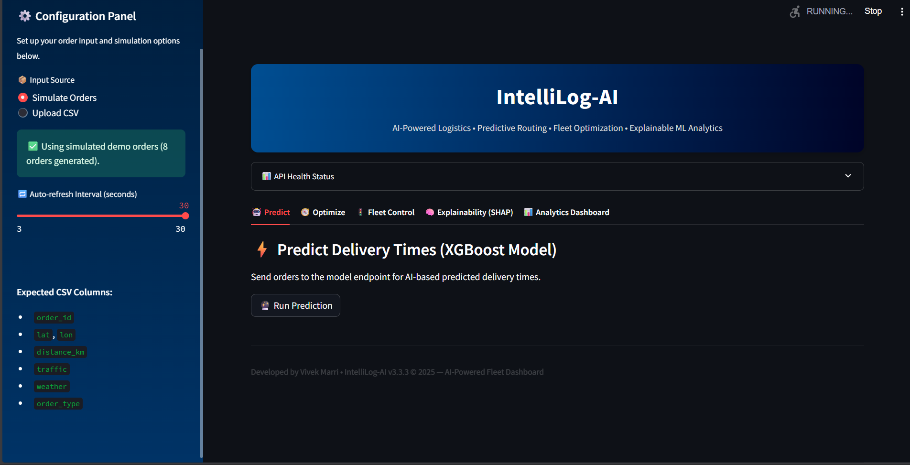
Main dashboard landing area and Predict tab with configuration sidebar (simulate orders / upload CSV).

### API Health & Dashboard Header
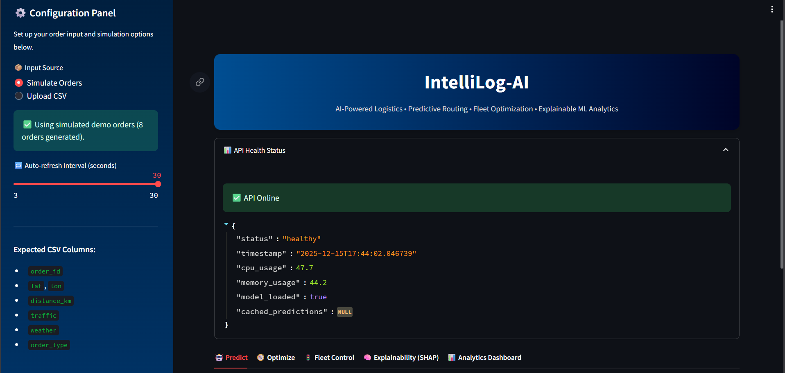
API health panel showing model status, timestamp, CPU/memory usage, and "API Online" indicator.

### Predict — Prediction Results & Table
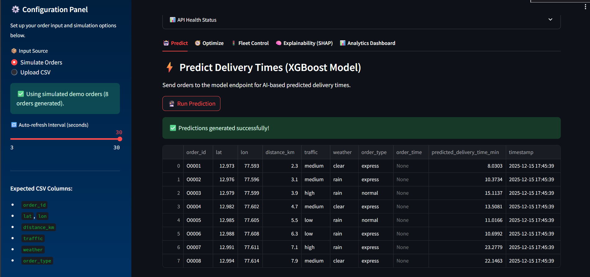
Tabular view of simulated orders and XGBoost predicted delivery times — great for per-order validation.


### Route Optimization Panel (Leaflet map view)
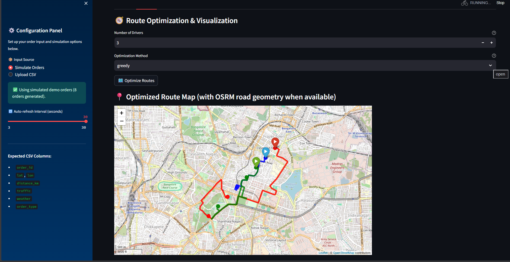
OSRM/Leaflet route geometry with driver markers and interactive controls.

### Route Map + Summary Table
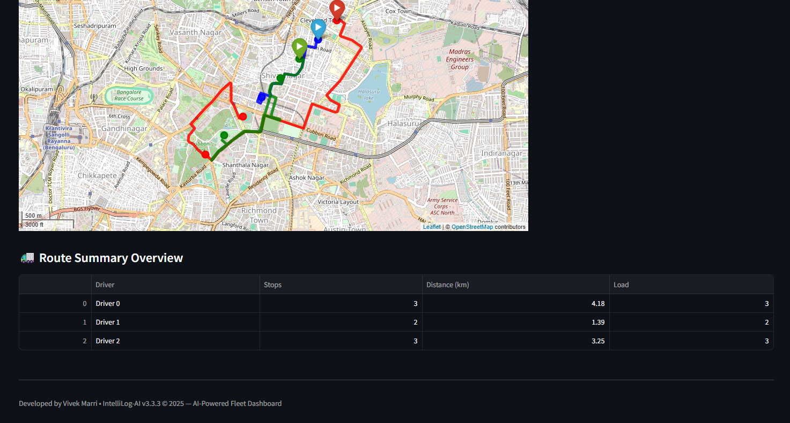
Optimized route map with colored polylines and driver route summary (stops, distance, load).

### Explainability — Feature Importance (SHAP)
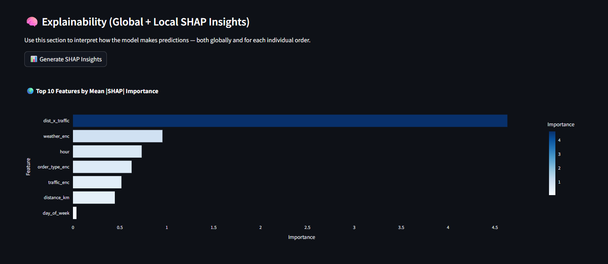
Top feature importance by mean absolute SHAP value — identifies primary drivers of predicted time.

### Explainability — SHAP Summary (Box/Distribution)
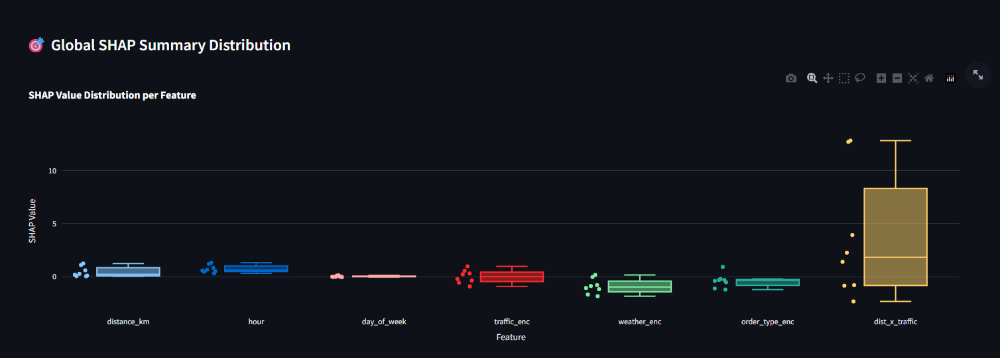
Global SHAP distribution per feature (boxplot) to visualize feature effect dispersion.

### Explainability — Local SHAP Heatmap / Table
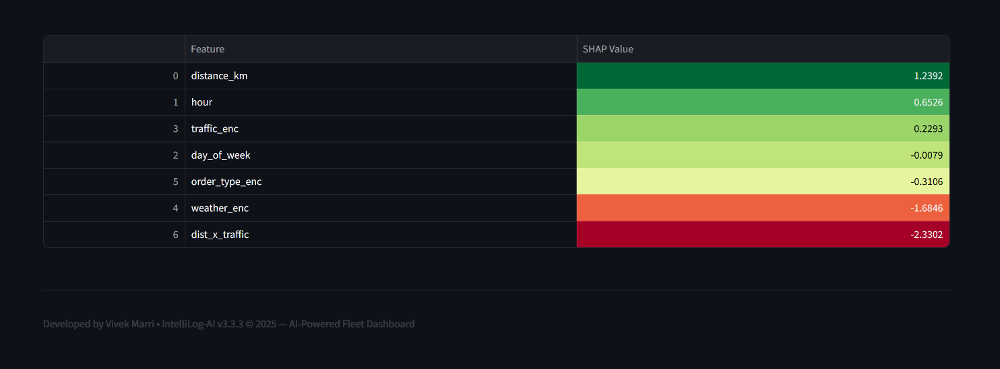
Local SHAP table showing per-feature contributions for a selected instance.

### Explainability — Local SHAP Bar (Instance)
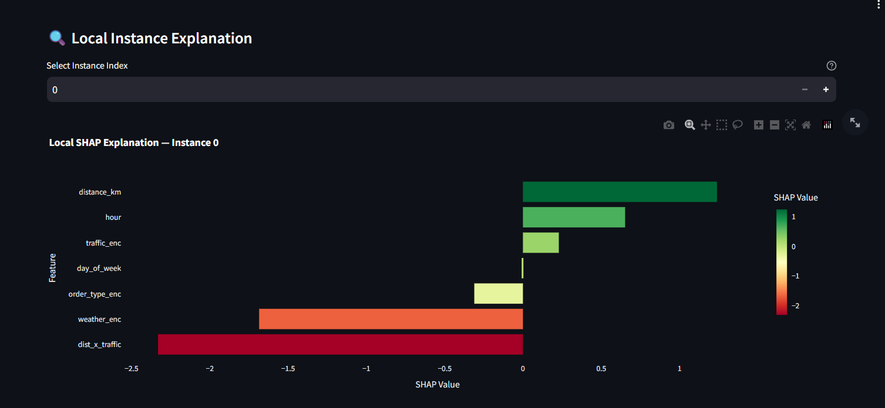
Local SHAP bar chart: which features pushed the prediction up or down for a single order.

### Advanced Analytics — KPI Summary
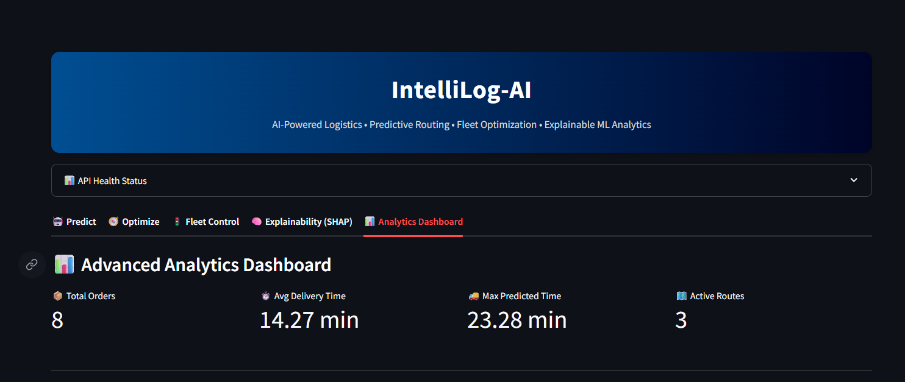
High-level KPIs: Total orders, Avg delivery time, Max predicted time, Active routes.

### Analytics — Distribution & Summary Stats
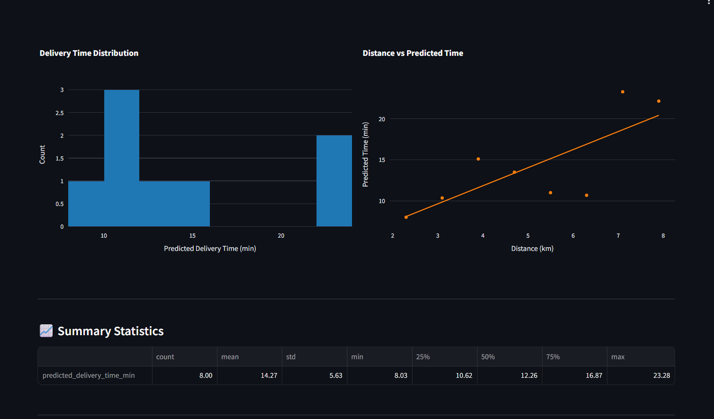
Delivery time histogram, distance vs predicted time scatter with trendline, and summary stats.

### Delivery Time Trend Over Time
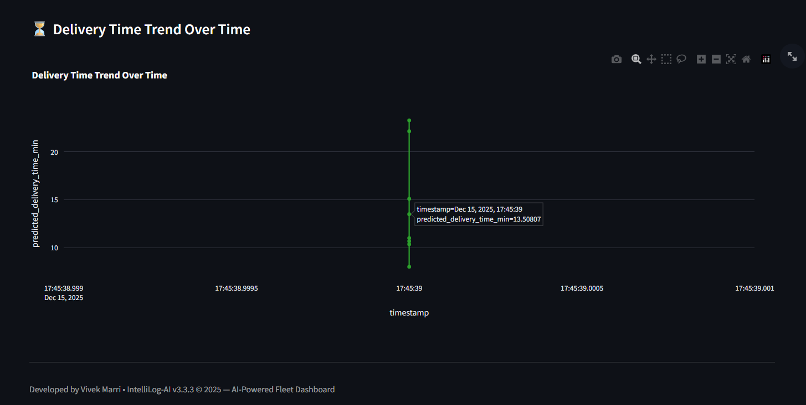
Time-series of predicted delivery times — useful for detecting drift or spikes.

### Delivery Time Comparison by Order Type
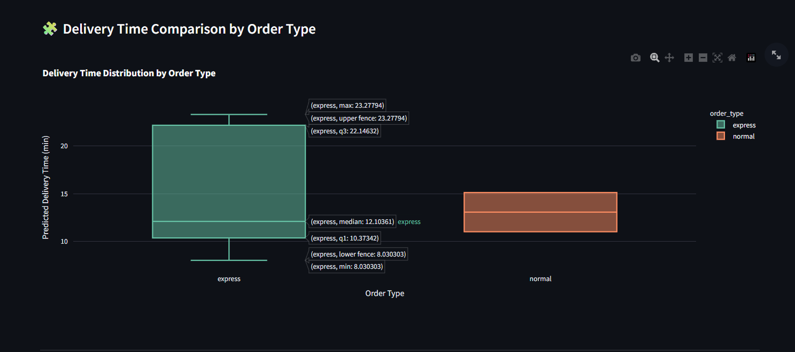
Boxplot comparing predicted delivery times by `order_type` (express vs normal) for SLA comparisons.

### Feature Correlation Heatmap
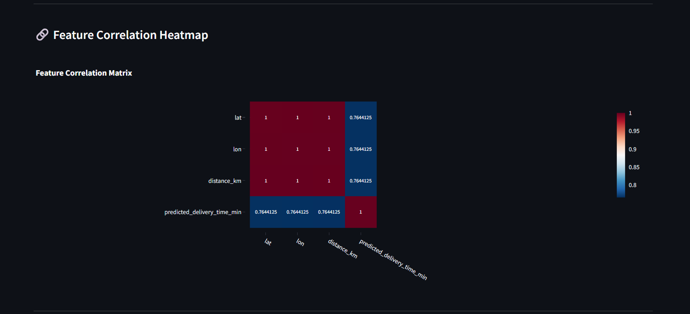
Correlation matrix between numeric features and predicted delivery time.

### Driver Route Distribution (Donut / Pie)
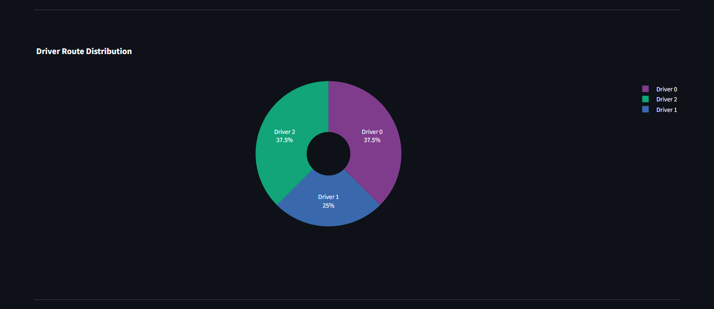
Driver load distribution (percentage of stops per driver) for balancing insights.

### Fleet Map & Movement History
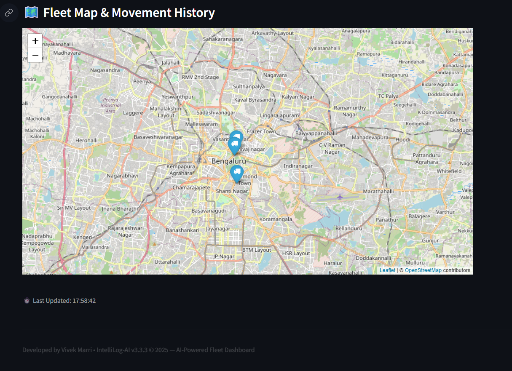
Live/ simulated fleet positions plotted on a map with movement history and last-updated timestamp.

### Fleet Control & Telemetry — Gauges / Overview 
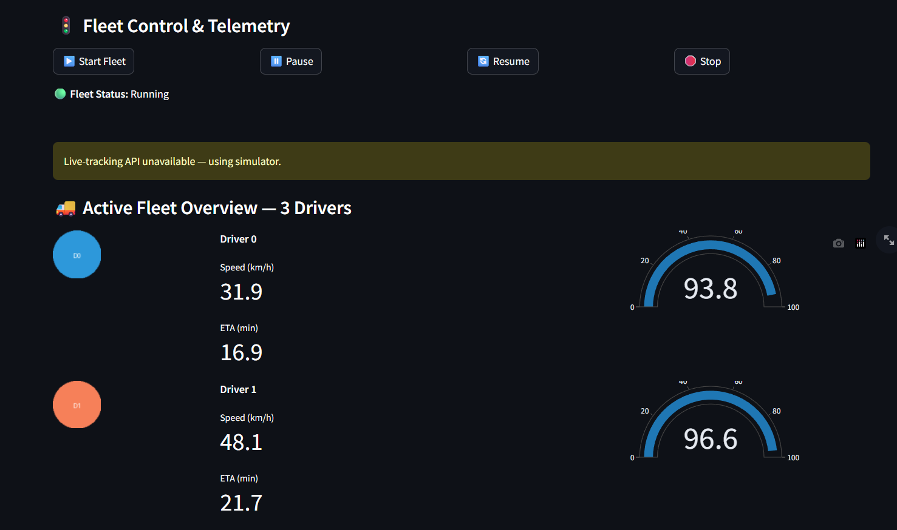
Fleet control panel and driver telemetry gauges (speed, ETA) for real-time monitoring.


---

## Architecture


---

Components:
- Streamlit dashboard: interactive configuration, maps, SHAP explainability, KPIs
- FastAPI backend: prediction endpoint, route planning, health and metrics endpoints
- Optimization: OR-Tools-based VRP solver with greedy/heuristic fallbacks
- Model: XGBoost regression model persisted to `models/`

---

## Quickstart (Docker)

1. Clone
```bash
git clone https://github.com/VIVEK-MARRI/IntelliLog-AI.git
cd IntelliLog-AI
```

2. Build & run
```bash
docker compose up -d --build
```

3. Access
- API: http://localhost:8000
- Dashboard: http://localhost:8501

Live deployed demo: https://intellilog-ai-dashboard.onrender.com/

---

## Development (Local)

1. Create virtual env
```bash
python -m venv venv
source venv/bin/activate   # Windows: venv\Scripts\activate
pip install -r requirements.txt
```

2. Start backend
```bash
uvicorn src.api.app:app --reload
```

3. Start dashboard
```bash
streamlit run src.dashboard.app.py
```

---

## API Endpoints & Example

- GET `/` or `/health` — API health check  
- GET `/metrics` — performance metrics (CPU/memory)  
- POST `/predict_delivery_time` — batch prediction for orders  
- POST `/plan_routes` — VRP route optimization

Example POST `/predict_delivery_time`
Request:
```json
{
  "orders": [
    {
      "order_id": "O001",
      "lat": 12.97,
      "lon": 77.59,
      "distance_km": 3.5,
      "traffic": "medium",
      "weather": "clear",
      "order_type": "normal"
    }
  ]
}
```

Response:
```json
[
  {
    "order_id": "O001",
    "predicted_delivery_time_min": 26.43
  }
]
```

CSV columns for bulk upload (dashboard expects):
- order_id
- lat, lon
- distance_km
- traffic
- weather
- order_type

---

## Project structure
```
IntelliLog-AI/
├── src/
│   ├── api/                # FastAPI backend
│   │   └── app.py
│   ├── dashboard/          # Streamlit dashboard
│   │   └── app.py
│   ├── optimization/       # VRP + heuristics + OR-Tools
│   │   └── vrp_solver.py
│   ├── features/           # Feature engineering
│   │   └── build_features.py
│   └── etl/                # Data generation & ingestion
│       └── ingest.py
├── models/                 # Trained ML models (persisted)
├── assets/                 # screenshots, logos
│   └── screenshots/
├── Dockerfile
├── docker-compose.yml
├── requirements.txt
└── README.md
```

---

## Roadmap
- Real-time GPS tracking & telemetry ingestion
- Dynamic traffic/weather API integrations
- Per-order SHAP local explanations in the UI
- Authentication (JWT) & role-based access control
- Cloud deployment templates (GCP / AWS / Render)

---

## Contributing
1. Fork the repo  
2. Create a branch for your feature  
3. Open a PR with a clear description and screenshots for UI changes

---

## License & Author
Released under the MIT License — see LICENSE.

Author: Vivek Marri  
Email: vivekmarriofficial@gmail.com  
GitHub: [VIVEK-MARRI](https://github.com/VIVEK-MARRI)

"Where Machine Learning meets Real-World Optimization."

---
............
