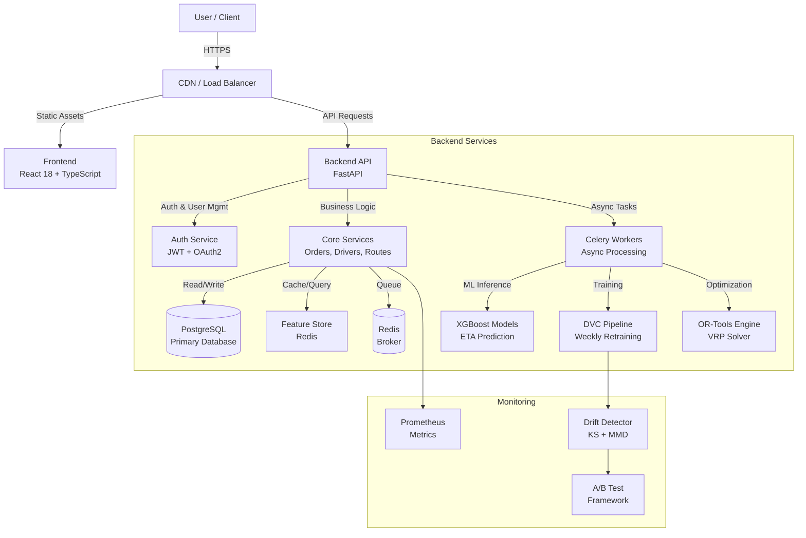

# 🚚 IntelliLog-AI

## Intelligent Logistics & Delivery Optimization System

[](https://www.python.org/)
[](https://fastapi.tiangolo.com/)
[](https://react.dev/)
[](https://www.typescriptlang.org/)
[](https://www.docker.com/)
[](https://xgboost.readthedocs.io/)
[](https://developers.google.com/optimization)
[](https://www.postgresql.org/)
[](https://redis.io/)
[](LICENSE)

---

<div align="center">

**Enterprise-Grade AI/ML Platform for Intelligent Route Optimization & Fleet Management**

[Features](#-key-features) • [Architecture](#-system-architecture) • [Quick Start](#-quick-start) • [API](#-api-documentation) • [Contributing](#-contributing)

</div>

---

## 📋 Table of Contents

- [Executive Summary](#executive-summary)
- [Key Features](#-key-features)
- [System Architecture](#-system-architecture)
- [Technology Stack](#-technology-stack)
- [Quick Start](#-quick-start)
- [Project Structure](#-project-structure)
- [API Documentation](#-api-documentation)
- [Development Guide](#-development-guide)
- [Deployment](#-deployment)
- [Contributing](#-contributing)
- [Roadmap](#-roadmap)
- [License & Authors](#-license--authors)
- [Additional Resources](#-additional-resources)

---

## Executive Summary

**IntelliLog-AI** is an enterprise-grade SaaS platform designed for intelligent logistics management and fleet optimization. It leverages cutting-edge AI/ML and mathematical optimization algorithms to solve real-world delivery challenges at scale.

### Core Capabilities

🎯 **ETA Prediction** — Accurately predict delivery times using XGBoost regression models with ~92% confidence  
🚗 **Route Optimization** — Solve complex Vehicle Routing Problems (VRP) using Google OR-Tools  
📊 **Fleet Management** — Real-time tracking, monitoring, and control of delivery operations  
📈 **Advanced Analytics** — Comprehensive KPI dashboards and performance insights  
🔐 **Multi-Tenant Architecture** — Complete data isolation with role-based access control (RBAC)  
🐳 **Cloud-Ready Infrastructure** — Production-ready Docker containerization and scalable deployment  

### Target Use Cases

- 🚚 **Delivery Services** — Optimize last-mile delivery operations
- 📦 **Logistics Companies** — Multi-tenant fleet management platforms
- 🍕 **Food Delivery Aggregators** — Real-time order routing and ETA
- 🚛 **Fleet Management Platforms** — Enterprise-scale vehicle optimization
- 📍 **On-Demand Services** — Courier, moving, repair services

---

## ✨ Key Features

- **Top-tier ML system** with experiment tracking, drift detection, A/B testing
- **ETA prediction** (XGBoost) with SHAP explainability, confidence scoring, OOD detection
- **Route optimization** (OR-Tools) with multi-tenant constraints
- **Continuous learning** from real feedback, weekly retraining, automatic drift alerts
- **Production-ready** monitoring: Prometheus metrics, Grafana dashboards, PagerDuty alerts
- **5-minute dev setup** (no auth needed yet), Docker Compose, Kubernetes-ready
- **Data governance**: DVC pipelines, MLflow tracking, full lineage & reproducibility
- **Enterprise scale** with feature store (Redis), batch inference, real-time prediction servers

---

## 🏗️ System Architecture

IntelliLog-AI uses a layered, service-oriented architecture that separates frontend presentation, API services, and async ML/optimization workloads. This keeps the system scalable and easy to evolve.

Your system is optimized for **ML excellence**:
- Feature store (Redis) for fast, reproducible feature retrieval
- Model registry (MLflow) with versioning and lineage
- Real-time prediction servers with caching
- Background training pipeline with DVC orchestration
- Continuous drift detection and A/B testing



- **Core services** handle orders, drivers, routes, and analytics
- **Async workers** run ETA inference, training, and VRP optimization
- **Feature store** enables reproducible, fast predictions
- **Continuous learning** from real feedback with automatic drift alerts
- **ML governance** via MLflow tracking, DVC pipelines, and A/B testing

For ultra-detailed ML system design, see [ML_SYSTEM.md](docs/ML_SYSTEM.md), [LEARNING_SYSTEM.md](docs/LEARNING_SYSTEM.md), and [MLOPS_DEPLOYMENT.md](docs/MLOPS_DEPLOYMENT.md).

### Database Design

```
TENANT (Multi-Tenancy Root)
├── USER
│   ├── id (UUID, PK)
│   ├── email (unique per tenant)
│   ├── role (Admin, Manager, Dispatcher)
│   └── tenant_id (FK)
│
├── DRIVER
│   ├── id (UUID, PK)
│   ├── name
│   ├── status (Active, Off, Break)
│   ├── vehicle_capacity
│   └── tenant_id (FK)
│
├── ORDER
│   ├── id (UUID, PK)
│   ├── order_number (unique per tenant)
│   ├── delivery_address
│   ├── weight, lat, lon
│   ├── time_window (start, end)
│   ├── status (Pending, Assigned, Completed)
│   ├── route_id (FK)
│   └── tenant_id (FK)
│
└── ROUTE
    ├── id (UUID, PK)
    ├── status (Planning, Active, Completed)
    ├── total_distance, total_time
    ├── geometry (GeoJSON)
    ├── driver_id (FK)
    └── tenant_id (FK)

Key Design Patterns:
✓ UUID primary keys for security
✓ Soft deletes for audit trails
✓ Timestamps (created_at, updated_at)
✓ Tenant ID partitioning
✓ Indexed foreign keys
```

### Data Flow Architecture

```
ORDER INGESTION FLOW:
1. User uploads CSV/API request
2. Backend validates data structure
3. Data stored in PostgreSQL
4. Celery task queued for processing
5. Frontend receives confirmation

ETA PREDICTION FLOW:
1. Backend receives order data
2. Feature extraction & preprocessing
3. XGBoost model inference
4. Results cached in Redis
5. Database update with predictions
6. Frontend displays ETAs

ROUTE OPTIMIZATION FLOW:
1. Collect pending orders
2. Get available drivers
3. Invoke OR-Tools VRP solver
4. Generate optimized routes
5. Cache results in Redis
6. Frontend visualizes on map
7. Send notifications to drivers
```

---

## 🛠️ Technology Stack

**Frontend:** React 18, TypeScript, Vite, Tailwind CSS, Shadcn/UI, Leaflet, Recharts

**Backend:** FastAPI, Python 3.10+, SQLAlchemy, Pydantic, Celery, XGBoost, OR-Tools

**Infrastructure:** PostgreSQL, Redis, Docker, Docker Compose, Nginx

---

## 🚀 Quick Start (5 Minutes)

### One-Command Setup

```bash
# Clone and initialize everything
git clone https://github.com/VIVEK-MARRI/IntelliLog-AI.git
cd IntelliLog-AI
./scripts/dev_bootstrap.sh

# Services start automatically
# Frontend:  http://localhost:5173
# API:       http://localhost:8000
# Docs:      http://localhost:8000/docs
```

**What it does:**
- Creates Python venv
- Installs dependencies
- Initializes PostgreSQL database
- Downloads pre-trained ML models
- Seeds 1,000 sample deliveries
- Prints start commands

---

### Without Bootstrap Script

**Option A: Docker Compose** (recommended for production-like env)

```bash
docker compose up --build
```

**Option B: Local Python** (fastest for ML development)

```bash
python -m venv venv
source venv/bin/activate
pip install -r requirements.txt
alembic upgrade head
python scripts/seed_db.py

# Terminal 1: Backend
uvicorn src.backend.app.main:app --reload

# Terminal 2: Frontend
cd src/frontend && npm run dev

# Terminal 3: Worker
celery -A src.backend.worker.celery_app worker --loglevel=info
```

---

## 📁 Project Structure

```
IntelliLog-AI/
│
├── src/
│   ├── backend/                         # FastAPI backend
│   ├── frontend/                        # React + Vite frontend
│   ├── worker/                          # Celery workers
│   ├── optimization/                    # VRP solver logic
│   ├── features/                        # Feature engineering
│   └── etl/                             # Data ingestion
├── docs/                                # Architecture, API, deployment docs
├── scripts/                             # Seed, train, validate
├── alembic/                             # DB migrations
├── models/                              # ML artifacts
├── docker-compose.yml                   # Local orchestration
├── Dockerfile                           # Backend image
└── README.md                            # This file
```

---

## 📡 API Documentation

**Quick links:**
- Swagger UI: http://localhost:8000/docs
- ReDoc: http://localhost:8000/redoc
- Full API reference: [docs/api.md](docs/api.md)

**Main resource groups:**
- Auth & tenants
- Orders & ETA prediction
- Routes & optimization
- Drivers & fleet status
- Analytics & monitoring

---

## 🔧 Development Guide

```bash
# Backend + frontend
# Install dependencies
pip install -r requirements.txt
npm install

# Setup database
alembic upgrade head

# Start services
uvicorn src.backend.app.main:app --reload &
npm run dev
```

For code quality, tests, and migrations, see [docs/README.md](docs/README.md).

---

## 📦 Deployment

```bash
# Build production images
docker compose -f docker-compose.yml build

# Start services
docker compose up -d

# Scale backend
docker compose up -d --scale backend=3

# Monitor logs
docker compose logs -f

# Stop services
docker compose down
```

Environment variables and cloud deployment guidance: [docs/deployment.md](docs/deployment.md).

---

## 🤝 Contributing

### Code Style
- **Python**: PEP 8, `black` formatter, `pylint` linter
- **TypeScript**: ESLint, `prettier` formatter
- **Commits**: Conventional commits (`feat:`, `fix:`, `docs:`)

### Pull Request Process
1. Fork repository
2. Create feature branch: `git checkout -b feature/feature-name`
3. Make changes with tests
4. Run quality checks: `black`, `pylint`, `mypy`, `pytest`
5. Commit with clear messages
6. Push and create Pull Request
7. Wait for code review

### Issue Reporting
- Use GitHub Issues
- Provide reproduction steps
- Include environment details
- Attach relevant logs

---

## 🗺️ Roadmap

### Q1 2026
- [ ] Real-time GPS tracking
- [ ] Mobile app (React Native)
- [ ] Advanced forecasting (LSTM)

### Q2 2026
- [ ] Google Maps integration
- [ ] WebSocket notifications
- [ ] Multi-language support

### Q3 2026
- [ ] AI routing suggestions
- [ ] ML model A/B testing
- [ ] Advanced reporting

### Q4 2026
- [ ] Blockchain audit trail
- [ ] Supply chain optimization
- [ ] Marketplace integration

---

## 📄 License & Authors

**License**: MIT — See [LICENSE](LICENSE) file

**Author**: Vivek Marri  
**Email**: marrivivek26@gmail.com  
**GitHub**: [@VIVEK-MARRI](https://github.com/VIVEK-MARRI)  
**Repository**: [IntelliLog-AI](https://github.com/VIVEK-MARRI/IntelliLog-AI)

---

## 📚 Additional Resources

### ML System Design (Top 1%)
- **[ML_QUICK_START.md](docs/ML_QUICK_START.md)** — 5-minute guide from zero to first prediction
- **[ML_SYSTEM.md](docs/ML_SYSTEM.md)** — Production ML architecture, feature store, model registry, explainability
- **[LEARNING_SYSTEM.md](docs/LEARNING_SYSTEM.md)** — Continuous learning pipeline, drift detection, A/B testing
- **[MLOPS_DEPLOYMENT.md](docs/MLOPS_DEPLOYMENT.md)** — Deployment stages, CI/CD, monitoring, runbooks

### Real-World Readiness
- **[REAL_WORLD_ASSESSMENT.md](docs/REAL_WORLD_ASSESSMENT.md)** — Honest assessment of what works now vs what needs implementation
- **Real-world use cases**: $2-5M annual savings potential (100-driver fleet)
- **Production timeline**: 8-12 weeks to full deployment

### Business & Go-To-Market
- **[BUSINESS_STRATEGY.md](docs/BUSINESS_STRATEGY.md)** — Pricing models ($2K-$30K/month), sales playbook, TAM analysis, 90-day to first customer
- **Customer profiles**: Who buys (regional logistics, 3PLs, couriers) vs who won't (Uber/Amazon)
- **Revenue potential**: $600K Year 1 → $2-3M Year 2 → $5-10M+ Year 3

### Technical References
- **[architecture.md](docs/architecture.md)** — System architecture overview
- **[API Reference](docs/api.md)** — REST API endpoints (add auth later)
- **[CONTRIBUTING](CONTRIBUTING.md)** — Development guidelines
- **[Contributing Guide](CONTRIBUTING.md)** — Contribution guidelines

---

<div align="center">

**Made with ❤️ by Vivek Marri**

⭐ If you find this helpful, please give it a star on GitHub!

[⬆ Back to Top](#intellog-ai)

</div>
