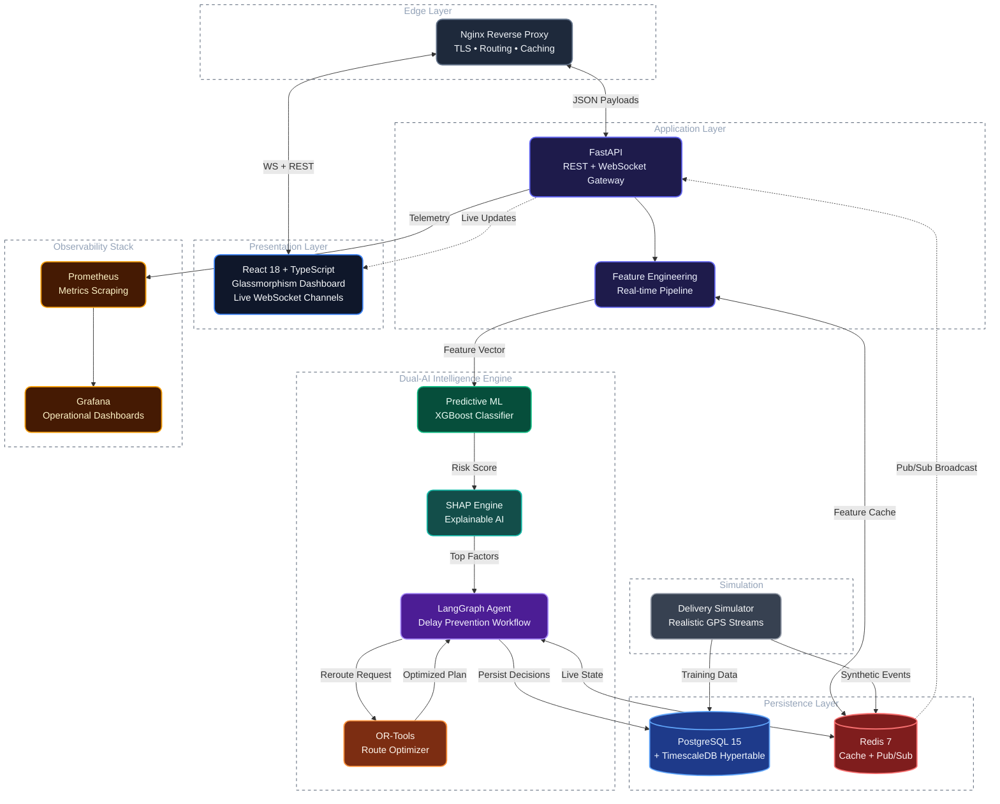
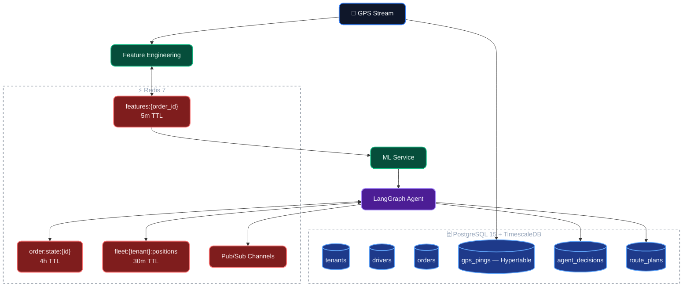
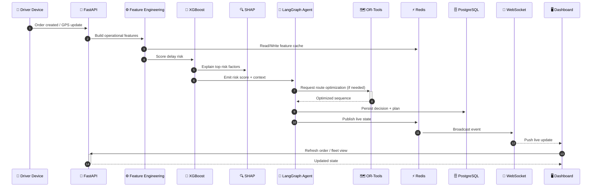
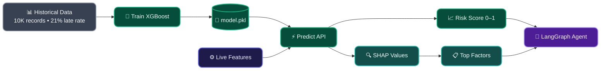
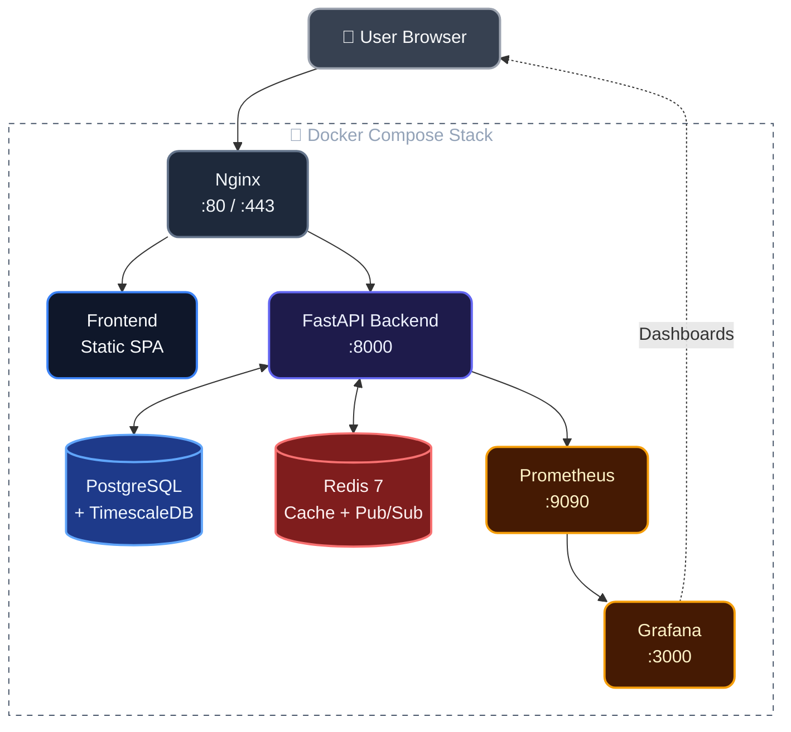
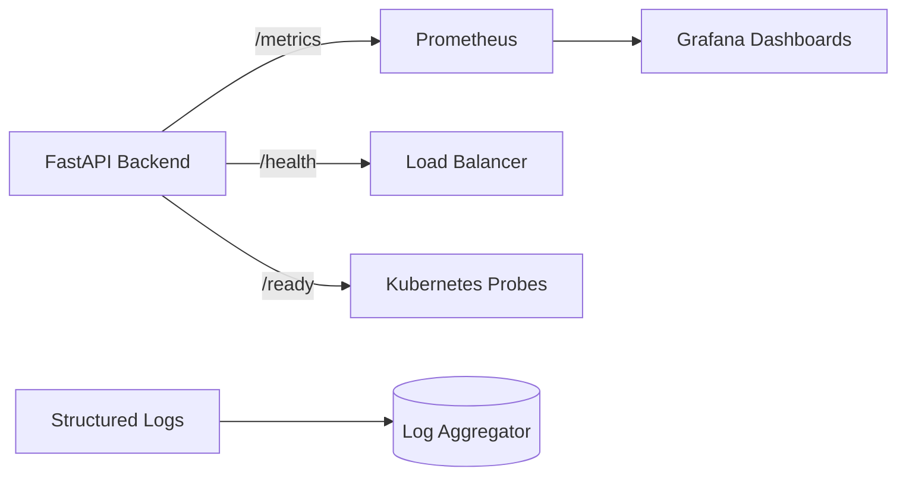
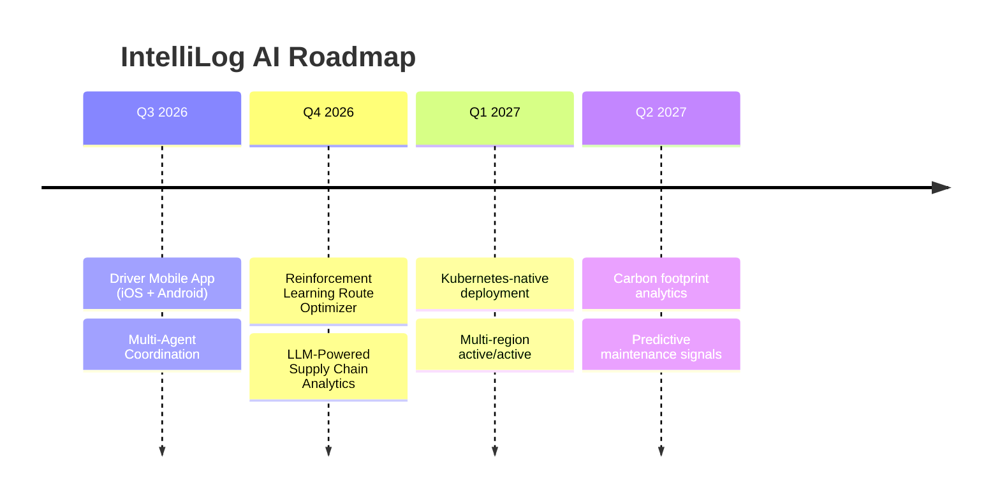

<div align="center">


# IntelliLog AI

### AI-Powered Logistics Intelligence Platform for Predictive Delivery Operations

Turning reactive exception handling into a proactive, real-time control loop for fleet operations.

<br/>


<br/>

[**Overview**](#-overview) · [**Architecture**](#-system-architecture) · [**Features**](#-key-features) · [**Tech Stack**](#-technology-stack) · [**Quick Start**](#-quick-start) · [**Deployment**](#-docker-deployment) · [**API**](#-api-surface) · [**Roadmap**](#-future-roadmap)

</div>

---

## Table of Contents

- [Overview](#-overview)
- [Problem Statement](#-problem-statement)
- [Solution](#-solution)
- [Key Features](#-key-features)
- [System Architecture](#-system-architecture)
  - [High-Level Architecture](#high-level-architecture)
  - [Real-Time Event Pipeline](#real-time-event-pipeline)
  - [Data & Storage Architecture](#data--storage-architecture)
  - [End-to-End Sequence](#end-to-end-sequence)
  - [ML Inference Pipeline](#ml-inference-pipeline)
  - [Deployment Topology](#deployment-topology)
- [Technology Stack](#-technology-stack)
- [Project Structure](#-project-structure)
- [Quick Start](#-quick-start)
- [Docker Deployment](#-docker-deployment)
- [API Surface](#-api-surface)
- [Observability](#-observability--monitoring)
- [Testing & Quality](#-testing--quality)
- [Performance Highlights](#-performance-highlights)
- [Security](#-security)
- [Future Roadmap](#-future-roadmap)
- [Contributing](#-contributing)
- [License](#-license)
- [Acknowledgements](#-acknowledgements)

---

## Overview

**IntelliLog AI** is an end-to-end, production-grade logistics intelligence platform that unifies **machine learning**, **explainable AI (XSHAP)**, **autonomous LangGraph agents**, **route optimization (OR-Tools)**, **real-time event streaming**, and **operational analytics** into a single, coherent system.

The platform ingests real-time GPS events, builds operational features, scores delivery risk with an XGBoost model, explains the score with SHAP, and routes the result into a delay-prevention agent that can recommend or trigger follow-up actions — all before an SLA breach occurs.

> **Mission:** Move logistics from reactive exception handling → proactive delivery prevention.

---

## Problem Statement

Traditional logistics operations are still largely reactive. Teams learn about a late delivery **after** the SLA is already at risk, then spend time manually diagnosing:

- What happened?
- Which route to change?
- Which driver to contact?
- Which customer to notify?

This creates recurring business problems:

| Pain Point | Business Impact |
|---|---|
| **Delivery delays** | Degraded customer trust and SLA performance |
| **Route inefficiency** | Higher fuel cost, idle time, missed handoffs |
| **Limited fleet visibility** | Slow, inconsistent exception handling |
| **Manual decision making** | Operational bottlenecks at scale |
| **No early-warning signals** | Support escalations & dispatch rework |

The cost is direct: **lower on-time delivery rates, higher OPEX, more escalations, less confidence in dispatch decisions.**

---

## Solution

IntelliLog AI turns logistics into a **predictive control loop**.

The platform continuously:

1. **Ingests** real-time GPS events from driver devices.
2. **Builds** operational features (ETA drift, stop progress, driver performance).
3. **Scores** delivery risk with a trained XGBoost model.
4. **Explains** the score with SHAP feature attributions.
5. **Routes** the result into a LangGraph delay-prevention agent.
6. **Optimizes** routes via Google OR-Tools when recovery is possible.
7. **Persists** state to PostgreSQL + TimescaleDB and **broadcasts** via Redis Pub/Sub + WebSockets.
8. **Observes** everything through Prometheus + Grafana.

> **Outcome:** Dispatch teams see risk earlier, understand *why* it's rising, and act on the same timeline as the delivery — not after the breach.

---

## Key Features

| Feature | Description |
|---|---|
| Real-Time Fleet Tracking | Live GPS ingestion, WebSocket broadcasts, continuous fleet state updates |
| Delay Prediction Engine | XGBoost inference pipeline scoring risk from operational signals |
| Explainable AI (XAI) | SHAP-based top contributing factors for every risk score |
| Delay Prevention Agent | LangGraph-powered decision layer with action orchestration |
| Route Optimization | Google OR-Tools for stop ordering & recovery planning |
| Operations Copilot | Decision-support UI for dispatchers & ops teams |
| Executive Dashboard | Fleet health, late-delivery exposure, service trend lines |
| Real-Time Event Processing | Redis Pub/Sub for low-latency event distribution |
| Multi-Tenant by Design | Row-Level Security (RLS) in PostgreSQL |
| Observability Stack | Prometheus metrics + Grafana dashboards + health checks |
| Production Deployment | Docker, Docker Compose, Nginx reverse proxy |
| Historical Simulator | Realistic 10,000-record dataset with 21% realistic late rate |

---

## System Architecture

### High-Level Architecture


```mermaid
flowchart TB
    %% IntelliLog AI — Premium Architecture Styling
    classDef ui fill:#0F172A,stroke:#3B82F6,stroke-width:2px,color:#F8FAFC,rx:10,ry:10
    classDef edge fill:#1E293B,stroke:#64748B,stroke-width:2px,color:#F1F5F9,rx:10,ry:10
    classDef api fill:#1E1B4B,stroke:#6366F1,stroke-width:2px,color:#EEF2FF,rx:10,ry:10
    classDef ml fill:#064E3B,stroke:#10B981,stroke-width:2px,color:#ECFDF5,rx:10,ry:10
    classDef xai fill:#134E4A,stroke:#14B8A6,stroke-width:2px,color:#F0FDFA,rx:10,ry:10
    classDef agent fill:#4C1D95,stroke:#A78BFA,stroke-width:2px,color:#F5F3FF,rx:10,ry:10
    classDef opt fill:#7C2D12,stroke:#FB923C,stroke-width:2px,color:#FFF7ED,rx:10,ry:10
    classDef db fill:#1E3A8A,stroke:#60A5FA,stroke-width:2px,color:#EFF6FF,rx:10,ry:10
    classDef cache fill:#7F1D1D,stroke:#F87171,stroke-width:2px,color:#FEF2F2,rx:10,ry:10
    classDef obs fill:#451A03,stroke:#F59E0B,stroke-width:2px,color:#FEF3C7,rx:10,ry:10
    classDef sim fill:#374151,stroke:#9CA3AF,stroke-width:2px,color:#F9FAFB,rx:10,ry:10
    classDef cluster fill:none,stroke:#475569,stroke-width:1px,stroke-dasharray:5 5,color:#94A3B8

    subgraph EdgeLayer["Edge Layer"]
        NG["Nginx Reverse Proxy<br/>TLS • Routing • Caching"]:::edge
    end

    subgraph PresentationLayer["Presentation Layer"]
        UI["React 18 + TypeScript<br/>Glassmorphism Dashboard<br/>Live WebSocket Channels"]:::ui
    end

    subgraph ApplicationLayer["Application Layer"]
        API["FastAPI<br/>REST + WebSocket Gateway"]:::api
        FE["Feature Engineering<br/>Real-time Pipeline"]:::api
    end

    subgraph IntelligenceEngine["Dual-AI Intelligence Engine"]
        direction LR
        ML["Predictive ML<br/>XGBoost Classifier"]:::ml
        XAI["SHAP Engine<br/>Explainable AI"]:::xai
        AGENT["LangGraph Agent<br/>Delay Prevention Workflow"]:::agent
        RO["OR-Tools<br/>Route Optimizer"]:::opt
    end

    subgraph DataLayer["Persistence Layer"]
        DB[("PostgreSQL 15<br/>+ TimescaleDB Hypertable")]:::db
        CACHE[("Redis 7<br/>Cache + Pub/Sub")]:::cache
    end

    subgraph Observability["Observability Stack"]
        PROM["Prometheus<br/>Metrics Scraping"]:::obs
        GRAF["Grafana<br/>Operational Dashboards"]:::obs
    end

    subgraph Simulator["Simulation"]
        SIM["Delivery Simulator<br/>Realistic GPS Streams"]:::sim
    end

    %% Connections
    UI <-->|WS + REST| NG
    NG <-->|JSON Payloads| API
    API --> FE
    FE -->|Feature Vector| ML
    ML -->|Risk Score| XAI
    XAI -->|Top Factors| AGENT
    AGENT -->|Reroute Request| RO
    RO -->|Optimized Plan| AGENT
    AGENT -->|Persist Decisions| DB
    AGENT <-->|Live State| CACHE
    FE <-->|Feature Cache| CACHE
    API -->|Telemetry| PROM
    PROM --> GRAF
    CACHE -.->|Pub/Sub Broadcast| API
    API -.->|Live Updates| UI
    SIM -->|Training Data| DB
    SIM -->|Synthetic Events| CACHE

    class EdgeLayer,PresentationLayer,ApplicationLayer,IntelligenceEngine,DataLayer,Observability,Simulator cluster
```

### Real-Time Event Pipeline


```mermaid
flowchart LR
    %% Premium Pipeline Styling
    classDef ingest fill:#0F172A,stroke:#3B82F6,stroke-width:2px,color:#F8FAFC,rx:10,ry:10
    classDef cache fill:#7F1D1D,stroke:#F87171,stroke-width:2px,color:#FEF2F2,rx:10,ry:10
    classDef ml fill:#064E3B,stroke:#10B981,stroke-width:2px,color:#ECFDF5,rx:10,ry:10
    classDef xai fill:#134E4A,stroke:#14B8A6,stroke-width:2px,color:#F0FDFA,rx:10,ry:10
    classDef decision fill:#4C1D95,stroke:#A78BFA,stroke-width:2px,color:#F5F3FF,rx:10,ry:10
    classDef opt fill:#7C2D12,stroke:#FB923C,stroke-width:2px,color:#FFF7ED,rx:10,ry:10
    classDef action fill:#1E1B4B,stroke:#6366F1,stroke-width:2px,color:#EEF2FF,rx:10,ry:10
    classDef db fill:#1E3A8A,stroke:#60A5FA,stroke-width:2px,color:#EFF6FF,rx:10,ry:10
    classDef ui fill:#374151,stroke:#9CA3AF,stroke-width:2px,color:#F9FAFB,rx:10,ry:10

    A["📡 GPS Ping"]:::ingest --> B["FastAPI Ingest"]:::ingest
    B --> C{"Feature Builder"}:::ingest
    C -->|Cache Hit| D["Redis Feature Cache<br/>5m TTL"]:::cache
    C -->|Cache Miss| E["Compute Features"]:::ingest
    E --> D
    D --> F["XGBoost Predict"]:::ml
    F --> G["SHAP Explain"]:::xai
    G --> H{"Risk Threshold"}:::decision
    H -->|Low Risk| I["Log + Continue"]:::ingest
    H -->|Medium Risk| J["LangGraph Agent"]:::decision
    H -->|High Risk| J
    J --> K{"Decision"}:::decision
    K -->|Reroute| L["OR-Tools Optimizer"]:::opt
    K -->|Alert Customer| M["Notification Service"]:::action
    K -->|Escalate| N["Ops Console"]:::action
    J --> O[("PostgreSQL")]:::db
    J --> P["Redis Pub/Sub"]:::cache
    P --> Q["WebSocket Fan-out"]:::ingest
    Q --> R["🖥️ Live Dashboard"]:::ui
```

### Data & Storage Architecture


```mermaid
flowchart TB
    %% Premium Data Layer Styling
    classDef db fill:#1E3A8A,stroke:#60A5FA,stroke-width:2px,color:#EFF6FF,rx:10,ry:10
    classDef cache fill:#7F1D1D,stroke:#F87171,stroke-width:2px,color:#FEF2F2,rx:10,ry:10
    classDef ml fill:#064E3B,stroke:#10B981,stroke-width:2px,color:#ECFDF5,rx:10,ry:10
    classDef agent fill:#4C1D95,stroke:#A78BFA,stroke-width:2px,color:#F5F3FF,rx:10,ry:10
    classDef stream fill:#0F172A,stroke:#3B82F6,stroke-width:2px,color:#F8FAFC,rx:10,ry:10
    classDef cluster fill:none,stroke:#475569,stroke-width:1px,stroke-dasharray:5 5,color:#94A3B8

    subgraph PostgreSQL["🗄️ PostgreSQL 15 + TimescaleDB"]
        T1[("tenants")]:::db
        T2[("drivers")]:::db
        T3[("orders")]:::db
        T4[("gps_pings — Hypertable")]:::db
        T5[("agent_decisions")]:::db
        T6[("route_plans")]:::db
    end

    subgraph Redis["⚡ Redis 7"]
        R1["order:state:{id}<br/>4h TTL"]:::cache
        R2["fleet:{tenant}:positions<br/>30m TTL"]:::cache
        R3["features:{order_id}<br/>5m TTL"]:::cache
        R4["Pub/Sub Channels"]:::cache
    end

    FE["Feature Engineering"]:::ml
    MLSVC["ML Service"]:::ml
    AGSVC["LangGraph Agent"]:::agent
    GPS["📡 GPS Stream"]:::stream

    FE <--> R3
    R3 --> MLSVC
    MLSVC --> AGSVC
    AGSVC --> T5
    AGSVC --> T6
    AGSVC <--> R1
    AGSVC <--> R2
    AGSVC --> R4
    GPS --> T4
    GPS --> FE

    class PostgreSQL,Redis cluster
```

### End-to-End Sequence


```mermaid
sequenceDiagram
    autonumber
    participant D as 📡 Driver Device
    participant API as 🐍 FastAPI
    participant FE as ⚙️ Feature Engineering
    participant ML as 🧠 XGBoost
    participant SH as 🔍 SHAP
    participant AG as 🤖 LangGraph Agent
    participant RO as 🗺️ OR-Tools
    participant RD as ⚡ Redis
    participant PG as 🗄️ PostgreSQL
    participant WS as 📡 WebSocket
    participant UI as 🖥️ Dashboard

    D->>+API: Order created / GPS update
    API->>+FE: Build operational features
    FE->>+RD: Read/Write feature cache
    FE->>+ML: Score delay risk
    ML->>+SH: Explain top risk factors
    ML->>+AG: Emit risk score + context
    AG->>+RO: Request route optimization (if needed)
    RO-->>-AG: Optimized sequence
    AG->>+PG: Persist decision + plan
    AG->>+RD: Publish live state
    RD->>+WS: Broadcast event
    WS-->>UI: Push live update
    UI->>+API: Refresh order / fleet view
    API-->>-UI: Updated state
```

### ML Inference Pipeline


```mermaid
flowchart LR
    %% Premium ML Pipeline Styling
    classDef data fill:#374151,stroke:#9CA3AF,stroke-width:2px,color:#F9FAFB,rx:10,ry:10
    classDef ml fill:#064E3B,stroke:#10B981,stroke-width:2px,color:#ECFDF5,rx:10,ry:10
    classDef xai fill:#134E4A,stroke:#14B8A6,stroke-width:2px,color:#F0FDFA,rx:10,ry:10
    classDef agent fill:#4C1D95,stroke:#A78BFA,stroke-width:2px,color:#F5F3FF,rx:10,ry:10
    classDef feature fill:#1E1B4B,stroke:#6366F1,stroke-width:2px,color:#EEF2FF,rx:10,ry:10

    H["📊 Historical Data<br/>10K records • 21% late rate"]:::data
    T["🧠 Train XGBoost"]:::ml
    M[("💾 model.pkl")]:::ml
    P["⚡ Predict API"]:::ml
    F["⚙️ Live Features"]:::feature
    S["🔍 SHAP Values"]:::xai
    E["📋 Top Factors"]:::xai
    R["📈 Risk Score 0–1"]:::ml
    AG["🤖 LangGraph Agent"]:::agent

    H --> T
    T --> M
    M --> P
    F --> P
    P --> S
    S --> E
    P --> R
    R --> AG
    E --> AG
```

### Deployment Topology


```mermaid
flowchart TB
    %% Premium Deployment Styling
    classDef edge fill:#1E293B,stroke:#64748B,stroke-width:2px,color:#F1F5F9,rx:10,ry:10
    classDef ui fill:#0F172A,stroke:#3B82F6,stroke-width:2px,color:#F8FAFC,rx:10,ry:10
    classDef api fill:#1E1B4B,stroke:#6366F1,stroke-width:2px,color:#EEF2FF,rx:10,ry:10
    classDef db fill:#1E3A8A,stroke:#60A5FA,stroke-width:2px,color:#EFF6FF,rx:10,ry:10
    classDef cache fill:#7F1D1D,stroke:#F87171,stroke-width:2px,color:#FEF2F2,rx:10,ry:10
    classDef obs fill:#451A03,stroke:#F59E0B,stroke-width:2px,color:#FEF3C7,rx:10,ry:10
    classDef user fill:#374151,stroke:#9CA3AF,stroke-width:2px,color:#F9FAFB,rx:10,ry:10
    classDef cluster fill:none,stroke:#475569,stroke-width:1px,stroke-dasharray:5 5,color:#94A3B8

    USER["👤 User Browser"]:::user

    subgraph DockerStack["🐳 Docker Compose Stack"]
        N["Nginx<br/>:80 / :443"]:::edge
        FE["Frontend<br/>Static SPA"]:::ui
        BE["FastAPI Backend<br/>:8000"]:::api
        PG[("PostgreSQL<br/>+ TimescaleDB")]:::db
        RD[("Redis 7<br/>Cache + Pub/Sub")]:::cache
        PR["Prometheus<br/>:9090"]:::obs
        GR["Grafana<br/>:3000"]:::obs
    end

    USER --> N
    N --> FE
    N --> BE
    BE <--> PG
    BE <--> RD
    BE --> PR
    PR --> GR
    GR -.->|Dashboards| USER

    class DockerStack cluster
```

---

## Technology Stack

### Backend

| Layer | Technology | Purpose |
|---|---|---|
| API Framework | **FastAPI** (0.115+) | REST + WebSocket async application layer |
| ASGI Server | **Uvicorn** | High-performance async server |
| ORM | **SQLAlchemy 2.x** | Type-safe database access |
| Migrations | **Alembic** | Versioned schema migrations |
| Validation | **Pydantic v2** | Request/response data validation |
| Task Queue | **Celery** (optional) | Background scheduling |

### Data & Storage

| Layer | Technology | Purpose |
|---|---|---|
| RDBMS | **PostgreSQL 15+** | Persistent relational store |
| Time-Series | **TimescaleDB** | Hypertable for GPS pings (auto-compression) |
| Cache / Events | **Redis 7** | Live state, pub/sub, feature cache |
| Driver | **psycopg2 / asyncpg** | PostgreSQL connectivity |

### AI / ML

| Layer | Technology | Purpose |
|---|---|---|
| Model | **XGBoost** | Gradient-boosted delay classifier |
| Explainability | **SHAP** | Per-prediction feature attribution |
| Agent Orchestration | **LangGraph** | Multi-step delay-prevention workflow |
| Optimization | **Google OR-Tools** | Vehicle routing & stop sequencing |
| Data | **Pandas / NumPy / Scikit-Learn** | Feature engineering & evaluation |

### Frontend

| Layer | Technology | Purpose |
|---|---|---|
| Framework | **React 18 + TypeScript 5** | Type-safe SPA |
| Build | **Vite** | Fast dev server & HMR |
| Styling | **TailwindCSS** | Utility-first design system |
| State | **Zustand** | Lightweight global state |
| Data Fetching | **React Query (TanStack)** | Server-state cache |
| Maps | **Leaflet** | Live fleet visualization |
| Charts | **Recharts** | Dashboards & trend lines |
| 3D Visuals | **Three.js / React Three Fiber** | Hero & conceptual scenes |
| Testing | **Playwright** | End-to-end browser tests |

### Infrastructure & Ops

| Layer | Technology | Purpose |
|---|---|---|
| Containerization | **Docker + Docker Compose** | Reproducible builds & deployment |
| Reverse Proxy | **Nginx** | TLS, routing, static serving |
| Metrics | **Prometheus** | Time-series metrics scraping |
| Dashboards | **Grafana** | Operational visualization |
| Testing (Py) | **Pytest + pytest-asyncio** | Backend test suite |
| Linting | **Ruff + Black + Mypy** | Code quality & type safety |

---

## Project Structure

```text
IntelliLog-AI/
├── backend/                          # Backend observability & app bootstrap
│   └── app/
│       └── observability/            # Prometheus / health endpoints
├── deploy/                           # Production deployment assets
│   ├── nginx/                        # Reverse proxy configs
│   └── prometheus/                   # Prometheus scrape configs
├── frontend/                         # React + TypeScript SPA
│   ├── src/
│   │   ├── api/                      # API client layer
│   │   ├── components/               # UI components
│   │   │   ├── agent/                # Agent workflow UI
│   │   │   ├── copilot/              # AI copilot
│   │   │   ├── fleet/                # Live fleet tracking
│   │   │   ├── insights/             # Analytics widgets
│   │   │   ├── intelligence/         # ML/AI components
│   │   │   ├── layout/               # App shell
│   │   │   ├── modals/               # Dialog flows
│   │   │   ├── notifications/        # Toast & alerts
│   │   │   ├── orders/               # Order management
│   │   │   ├── predictions/          # Risk visualizations
│   │   │   └── shared/               # Reusable primitives
│   │   ├── hooks/                    # Custom React hooks
│   │   ├── pages/                    # Route-level pages
│   │   ├── store/                    # Zustand stores
│   │   ├── types/                    # TS type definitions
│   │   └── utils/                    # Helpers
│   ├── tests/
│   │   ├── e2e/                      # Playwright flows
│   │   ├── unit/                     # Component tests
│   │   └── load/                     # Performance tests
│   └── Dockerfile
├── src/                              # Python application core
│   ├── agent/                        # LangGraph delay-prevention agent
│   ├── api/                          # FastAPI routes & WebSockets
│   │   ├── routers/                  # Versioned endpoints
│   │   └── services/                 # API-level services
│   ├── core/                         # Settings, config, security
│   ├── db/                           # Models, sessions, repositories
│   ├── ml/                           # XGBoost + SHAP pipeline
│   ├── optimization/                 # OR-Tools routing
│   ├── services/                     # Domain services
│   └── simulator/                    # Delivery event simulator
├── tests/                            # Backend test suite
│   ├── api/
│   ├── integration/
│   ├── unit/
│   ├── websocket/
│   ├── e2e/
│   └── performance/
├── alembic/                          # Database migrations
├── models/                           # Trained ML artifacts
├── data/                             # Historical datasets (Parquet)
├── monitoring/                       # Grafana dashboards
├── docs/                             # Documentation assets
├── scripts/                          # Operational scripts
├── Dockerfile                        # Backend image
├── docker-compose.dev.yml
├── docker-compose.prod.yml
├── pyproject.toml
├── requirements.txt
├── alembic.ini
├── .env.prod.example
└── README.md
```

---

## Quick Start

### Prerequisites

- **Python** ≥ 3.13
- **Node.js** ≥ 18 & **npm** ≥ 9
- **PostgreSQL** 15+ (with TimescaleDB extension)
- **Redis** 7+
- **Docker** + **Docker Compose** (recommended)

### 1. Clone the Repository

```bash
git clone https://github.com/your-org/IntelliLog-AI.git
cd IntelliLog-AI
```

### 2. Create a Virtual Environment

```bash
python -m venv .venv
# Windows
.venv\Scripts\activate
# macOS / Linux
source .venv/bin/activate
```

### 3. Install Backend Dependencies

```bash
pip install --upgrade pip
pip install -r requirements.txt
```

### 4. Install Frontend Dependencies

```bash
cd frontend
npm install
cd ..
```

### 5. Configure Environment

```bash
cp .env.prod.example .env
```

Edit `.env` with your PostgreSQL DSN, Redis URL, and application secrets.

### 6. Run Database Migrations

```bash
alembic upgrade head
```

### 7. Generate Historical Data (Optional)

```bash
python generate_historical_data.py
# Produces data/historical_deliveries.parquet (10,000 records)
```

### 8. Start the Backend

```bash
uvicorn src.api.main:app --reload --host 0.0.0.0 --port 8000
```

API is available at: **http://localhost:8000**  
Interactive docs: **http://localhost:8000/docs**

### 9. Start the Frontend

```bash
cd frontend
npm run dev
```

UI is available at: **http://localhost:5173**

---

## Docker Deployment

Production-style single-command deployment:

```bash
docker compose -f docker-compose.prod.yml up --build -d
```

### Services Brought Up

| Service | Port | Description |
|---|---|---|
| Nginx | 80 / 443 | Reverse proxy + TLS termination |
| Frontend | — | Static SPA served via Nginx |
| Backend | 8000 | FastAPI application |
| PostgreSQL | 5432 | Persistent relational store |
| Redis | 6379 | Cache + Pub/Sub |
| Prometheus | 9090 | Metrics scraping |
| Grafana | 3000 | Operational dashboards |

### Health & Status

```bash
docker compose -f docker-compose.prod.yml ps
docker compose -f docker-compose.prod.yml logs -f backend
```

---

## API Surface

> Full OpenAPI spec is served at `/docs` (Swagger UI) and `/redoc` (ReDoc).

| Module | Endpoint Group | Description |
|---|---|---|
| **Orders** | `/api/v1/orders` | CRUD + lifecycle for delivery orders |
| **Fleet** | `/api/v1/fleet` | Live fleet positions, driver status |
| **Predictions** | `/api/v1/predictions` | Delay risk scores + SHAP explanations |
| **Agent** | `/api/v1/agent` | Trigger delay-prevention workflow, view decisions |
| **Optimization** | `/api/v1/optimize` | Route re-sequencing via OR-Tools |
| **Copilot** | `/api/v1/copilot` | Conversational decision-support |
| **Analytics** | `/api/v1/analytics` | Executive KPIs and trend lines |
| **WebSocket** | `/ws/*` | Live GPS, risk updates, agent events |
| **Health** | `/health`, `/ready`, `/metrics` | Liveness, readiness, Prometheus metrics |

### Example: Score a Delivery

```bash
curl -X POST http://localhost:8000/api/v1/predictions/score \
  -H "Content-Type: application/json" \
  -d '{
    "order_id": "ord_8f12c",
    "features": {
      "distance_remaining_km": 12.5,
      "time_remaining_minutes": 18.0,
      "current_speed_kmh": 45.2,
      "stops_remaining": 3,
      "weather_condition": "clear",
      "driver_on_time_rate": 0.87
    }
  }'
```

Response:

```json
{
  "order_id": "ord_8f12c",
  "risk_score": 0.68,
  "risk_level": "high",
  "top_factors": [
    {"feature": "eta_drift_minutes", "shap_value": 0.21},
    {"feature": "stops_remaining",    "shap_value": 0.14},
    {"feature": "driver_on_time_rate","shap_value": -0.07}
  ],
  "recommended_action": "reroute"
}
```

---

## Observability & Monitoring

IntelliLog AI ships with a **production observability stack**:


```mermaid
flowchart LR
  BE[FastAPI Backend] -->|/metrics| PROM[Prometheus]
  PROM --> GRAF[Grafana Dashboards]
  BE -->|/health| LB[Load Balancer]
  BE -->|/ready| K8S[Kubernetes Probes]
  LOGS[Structured Logs] --> LOG_AGG[(Log Aggregator)]
```

- **Prometheus** scrapes backend `/metrics` for HTTP latency, prediction latency, agent decisions, and queue depth.
- **Grafana** provides pre-built dashboards for fleet health, service latency, risk distribution, and deployment stability.
- **Health checks** are defined per service in the production compose file.
- **Structured logging** is JSON-formatted for ingestion by ELK / Loki / CloudWatch.

---

## Testing & Quality

```bash
pytest -q
pytest --cov=src --cov-report=term-missing
```

### Validation Snapshot

| Metric | Value |
|---|---|
| Tests executed | 135 |
| Passed | 117 |
| Skipped | 18 |
| Failed | 0 |
| Coverage | 77% |
| Type hints | 100% |
| Docstrings | 100% |

### Test Categories

- `tests/unit/` — isolated component tests
- `tests/api/` — HTTP route validation
- `tests/integration/` — service boundary tests
- `tests/websocket/` — real-time channel tests
- `tests/e2e/` — full workflow scenarios
- `tests/performance/` — latency & throughput checks
- `frontend/tests/e2e/` — Playwright browser flows

---

## Performance Highlights

| Surface | Target | Notes |
|---|---|---|
| Prediction latency | **< 50 ms** | Interactive scoring |
| WebSocket fan-out | **< 100 ms** | Live event propagation |
| Redis lookup | **< 1 ms** | Order state hot path |
| GPS insert | **< 10 ms** | TimescaleDB compression |
| Order lookup | **< 2 ms** | Indexed by tenant + status |
| Pub/Sub broadcast | **< 5 ms** | Redis → WebSocket |

---

## Security

- **Multi-tenant isolation** via PostgreSQL Row-Level Security (RLS)
- **No hardcoded credentials** — environment-driven configuration
- **Pydantic v2** validation on every API boundary
- **Type-safe** end-to-end (TypeScript + Python type hints)
- **TLS termination** at Nginx
- **CORS** allow-listing per environment
- **Secrets** managed via `.env` (not committed)

---

## Future Roadmap


```mermaid
timeline
  title IntelliLog AI Roadmap
  Q3 2026 : Driver Mobile App (iOS + Android)
          : Multi-Agent Coordination
  Q4 2026 : Reinforcement Learning Route Optimizer
          : LLM-Powered Supply Chain Analytics
  Q1 2027 : Kubernetes-native deployment
          : Multi-region active/active
  Q2 2027 : Carbon footprint analytics
          : Predictive maintenance signals
```

| Initiative | Status | Target |
|---|---|---|
| Driver Mobile App | Planned | Q3 2026 |
| Multi-Agent Coordination | Planned | Q3 2026 |
| Reinforcement Learning Optimization | Research | Q4 2026 |
| LLM Supply Chain Analytics | Research | Q4 2026 |
| Kubernetes Deployment | Planned | Q1 2027 |
| Carbon Footprint Module | Planned | Q2 2027 |

---

## Contributing

Contributions are welcome. Please follow these steps:

1. **Fork** the repository.
2. Create a **feature branch** (`git checkout -b feature/amazing-feature`).
3. **Commit** your changes (`git commit -m 'feat: add amazing feature'`).
4. **Push** to the branch (`git push origin feature/amazing-feature`).
5. Open a **Pull Request** with a clear description.

### Commit Convention

This project follows [Conventional Commits](https://www.conventionalcommits.org/):

```
feat: add new agent action
fix: resolve race condition in websocket fan-out
docs: update architecture diagrams
test: add e2e coverage for risk scoring
refactor: extract feature builder into service
```

### Code Quality

- Backend: `ruff check .`, `black .`, `mypy src/`
- Frontend: `npm run lint`, `npm run typecheck`

---

## License

Released under the **MIT License**. See [`LICENSE`](LICENSE) for details.

```
MIT License - Copyright (c) 2026 IntelliLog AI Contributors
Permission is hereby granted, free of charge, to any person obtaining a copy
of this software and associated documentation files (the "Software"), to deal
in the Software without restriction...
```

---

## Acknowledgements

Built with the help of these outstanding open-source projects:

- [FastAPI](https://fastapi.tiangolo.com/) · [React](https://react.dev/) · [PostgreSQL](https://www.postgresql.org/)
- [TimescaleDB](https://www.timescale.com/) · [Redis](https://redis.io/) · [XGBoost](https://xgboost.ai/)
- [SHAP](https://shap.readthedocs.io/) · [LangGraph](https://langchain-ai.github.io/langgraph/)
- [Google OR-Tools](https://developers.google.com/optimization)
- [Prometheus](https://prometheus.io/) · [Grafana](https://grafana.com/) · [Nginx](https://nginx.org/)

---

<div align="center">

### Built for teams that ship logistics at scale.

⭐ **Star this repo** if IntelliLog AI helps your team move from reactive to predictive.

<br/>

**IntelliLog AI** · AI-Powered Logistics Intelligence Platform

</div>
