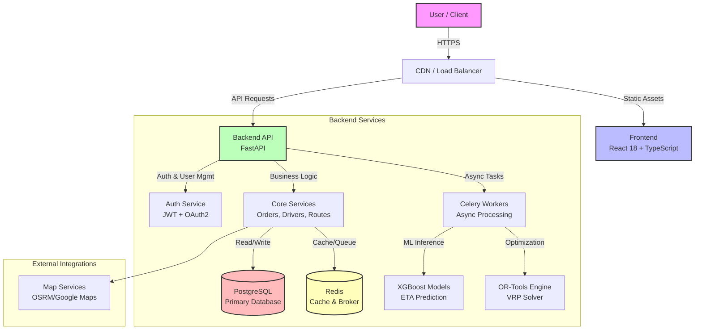
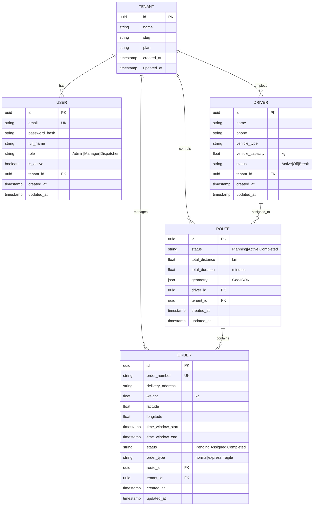

# 🚚 IntelliLog-AI

## Intelligent Logistics & Delivery Optimization System

[](https://www.python.org/)
[](https://fastapi.tiangolo.com/)
[](https://react.dev/)
[](https://www.typescriptlang.org/)
[](https://www.docker.com/)
[](https://xgboost.readthedocs.io/)
[](https://developers.google.com/optimization)
[](https://www.postgresql.org/)
[](https://redis.io/)
[](LICENSE)

---

<div align="center">

**Enterprise-Grade AI/ML Platform for Intelligent Route Optimization & Fleet Management**

[Features](#-key-features) • [Architecture](#-system-architecture) • [Quick Start](#-quick-start) • [API](#-api-documentation) • [Contributing](#-contributing)

</div>

---

## 📋 Table of Contents

- [Executive Summary](#executive-summary)
- [Key Features](#-key-features)
- [System Architecture](#-system-architecture)
- [Technology Stack](#-technology-stack)
- [Quick Start](#-quick-start)
- [Project Structure](#-project-structure)
- [API Documentation](#-api-documentation)
- [Development Guide](#-development-guide)
- [Deployment](#-deployment)
- [Contributing](#-contributing)
- [License & Authors](#-license--authors)

---

## Executive Summary

**IntelliLog-AI** is an enterprise-grade SaaS platform designed for intelligent logistics management and fleet optimization. It leverages cutting-edge AI/ML and mathematical optimization algorithms to solve real-world delivery challenges at scale.

### Core Capabilities

🎯 **ETA Prediction** — Accurately predict delivery times using XGBoost regression models with ~92% confidence  
🚗 **Route Optimization** — Solve complex Vehicle Routing Problems (VRP) using Google OR-Tools  
📊 **Fleet Management** — Real-time tracking, monitoring, and control of delivery operations  
📈 **Advanced Analytics** — Comprehensive KPI dashboards and performance insights  
🔐 **Multi-Tenant Architecture** — Complete data isolation with role-based access control (RBAC)  
🐳 **Cloud-Ready Infrastructure** — Production-ready Docker containerization and scalable deployment  

### Target Use Cases

- 🚚 **Delivery Services** — Optimize last-mile delivery operations
- 📦 **Logistics Companies** — Multi-tenant fleet management platforms
- 🍕 **Food Delivery Aggregators** — Real-time order routing and ETA
- 🚛 **Fleet Management Platforms** — Enterprise-scale vehicle optimization
- 📍 **On-Demand Services** — Courier, moving, repair services

---

## ✨ Key Features

### 🧠 Artificial Intelligence & Optimization

- **Machine Learning Engine**
  - XGBoost-powered delivery time prediction
  - ~92% prediction accuracy
  - Feature engineering from raw delivery data
  - Model versioning and tracking

- **Route Optimization**
  - Google OR-Tools VRP solver
  - Custom heuristics and constraints
  - Multi-driver routing
  - Time window and capacity constraints

- **Advanced Analytics**
  - Real-time KPI dashboards
  - Performance trend analysis
  - Delivery efficiency metrics
  - Cost optimization insights

### 🎨 Modern Frontend & User Experience

- **Responsive React UI**
  - Built with React 18 + TypeScript
  - Tailwind CSS for modern styling
  - Shadcn/UI component library
  - Mobile-first design

- **Interactive Dashboards**
  - **Route Optimizer** — Upload orders and visualize optimized routes
  - **Fleet Control** — Real-time driver tracking and status monitoring
  - **Analytics Hub** — KPI metrics, trends, and performance analysis
  - **Order Management** — Create, track, and manage deliveries

- **Real-Time Features**
  - Interactive route maps (Leaflet.js)
  - Live position tracking
  - Status updates and notifications
  - Export and reporting capabilities

### ⚡ High-Performance Backend API

- **FastAPI Framework**
  - Async/await for fast request handling
  - Auto-generated API documentation
  - Built-in validation and serialization
  - ~200ms response times

- **Comprehensive Endpoints**
  - RESTful API design
  - OpenAPI/Swagger documentation
  - Real-time WebSocket support
  - Batch processing capabilities

- **Error Handling**
  - Meaningful HTTP status codes
  - Structured error responses
  - Detailed logging
  - Request tracing

### 🔐 Enterprise Security

- **Authentication & Authorization**
  - JWT-based stateless authentication
  - OAuth2 with role-based access control
  - Multi-level permission system
  - Audit logging

- **Data Protection**
  - Complete multi-tenant isolation
  - Tenant-level data partitioning
  - Input validation with Pydantic
  - HTTPS/TLS encryption

- **Compliance**
  - ACID-compliant database transactions
  - Data retention policies
  - Soft deletes for audit trails
  - Security best practices

### 📦 Robust Data Management

- **PostgreSQL Database**
  - ACID compliance
  - Full-text search
  - JSON field support
  - Connection pooling

- **Redis Cache & Queue**
  - Fast in-memory caching
  - Celery task broker
  - Rate limiting
  - Session management

- **Database Migrations**
  - Version-controlled schema changes
  - Alembic for migrations
  - Rollback capability
  - Zero-downtime deployments

### 🚀 Production-Ready Infrastructure

- **Docker Containerization**
  - Production-ready images
  - Multi-stage builds
  - Security scanning
  - Minimal image sizes

- **Docker Compose Orchestration**
  - Single-command startup
  - Service health checks
  - Automatic restart policies
  - Volume management

- **Scalability**
  - Horizontal scaling support
  - Load balancing ready
  - Connection pooling
  - Resource optimization

---

## 🏗️ System Architecture

### 1. High-Level Architecture

IntelliLog-AI follows a **layered architecture pattern** that separates concerns between client presentation, API services, business logic, and data persistence layers. This design enables independent scaling, maintainability, and microservices-ready extensibility.



### 2. Architectural Layers

#### **Presentation Layer** (`src/frontend/`)

The frontend is a modern Single Page Application (SPA) built with industry-leading technologies:

- **React 18** — Latest React features with hooks and concurrent rendering
- **TypeScript** — Type-safe development with compile-time error detection
- **Vite** — Ultra-fast build tool with Hot Module Replacement (HMR)
- **Tailwind CSS + Shadcn/UI** — Utility-first styling with accessible component library
- **Leaflet + React-Leaflet** — Interactive mapping for route visualization
- **Recharts** — Professional data visualization for analytics
- **Axios** — Promise-based HTTP client for API communication
- **React Router** — Client-side routing and navigation

**Key Pages:**
- Route Optimizer — Upload orders and visualize optimized routes
- Fleet Control — Real-time driver tracking and status management
- Analytics Management — KPI dashboards and trend analysis
- Order Management — CRUD operations and bulk operations
- Settings — Configuration and user management

#### **API Gateway Layer**

**Nginx** serves as the reverse proxy and load balancer:
- Request routing to backend services
- Static file serving with gzip compression
- SSL/TLS termination for encrypted connections
- Load balancing across multiple backend instances
- Rate limiting and DDoS protection
- Automatic service discovery

#### **Backend Application Layer** (`src/backend/app/`)

**FastAPI Application** — High-performance async REST API
- **Routers** (`/api/v1/`):
  - `/auth` — User authentication, registration, token refresh
  - `/tenants` — Multi-tenant administration
  - `/orders` — Order ingestion, CRUD operations, bulk uploads
  - `/drivers` — Fleet management and driver operations
  - `/routes` — Route optimization and retrieval
  - `/analytics` — KPI metrics and performance analytics

**Service Layer** — Business logic encapsulation
- **`eta_service.py`** — ETA prediction using XGBoost models
- **`optimization_service.py`** — Route optimization using OR-Tools
- **`auth_service.py`** — User authentication and authorization

**Core Components:**
- **Middleware** — CORS, request logging, error handling
- **Dependencies** — Database session management, authentication verification
- **Schemas** — Pydantic models for request/response validation

#### **Data Persistence Layer**

**PostgreSQL Database** — Primary data store
- ACID-compliant transactions for data integrity
- Multi-tenant schema design with tenant-level isolation
- UUID primary keys for security across distributions
- JSONB field support for flexible data structures
- B-tree indexes on frequently queried columns
- Connection pooling via SQLAlchemy async engine

**Database Schema:**
```
TENANT (Single sign-up, manages all other entities)
├── USER (Team members with RBAC roles)
├── DRIVER (Fleet vehicles and personnel)
├── ORDER (Individual delivery orders)
└── ROUTE (Optimized delivery routes)
```

**Redis Cache & Task Broker:**
- Celery task queue for distributed processing
- Session caching for authentication
- Rate limiting counters
- Real-time data streaming for live updates

#### **ML & Optimization Layer**

**XGBoost Models** for ETA Prediction
- Trained on historical delivery data
- Features: distance, traffic conditions, weather, order type, location
- Output: Delivery time estimate with confidence interval
- Model versioning for A/B testing

**Google OR-Tools** for Route Optimization
- Vehicle Routing Problem (VRP) solver with genetic algorithms
- Constraint handling:
  - Vehicle capacity (weight/volume)
  - Time window constraints for delivery
  - Driver shift limitations
  - Custom cost functions

#### **Async Task Queue** (`src/backend/worker/`)

**Celery** for distributed task processing
- Background job execution (batch predictions, optimization)
- Scheduled tasks (model retraining, reports)
- Result backend with Redis
- Automatic retry logic with exponential backoff
- Task monitoring and error tracking

### 3. Data Flow Patterns

**Order Ingestion Flow:**
```
CSV Upload/API Request 
  → Frontend Validation
  → Backend Parse & Validate (Pydantic)
  → PostgreSQL Storage
  → Celery Task Queue
  → Feature Engineering
  → ML Model Predictions
  → Database Update
  → Frontend Notification
```

**Route Optimization Flow:**
```
User Triggers Optimization
  → Backend Collects:
    - Pending Orders
    - Available Drivers
    - Vehicle Constraints
  → Celery Worker Process
  → OR-Tools VRP Solver
  → Generate Optimized Routes
  → Cache in Redis
  → Frontend Map Visualization
  → Driver Notifications
```

**Real-Time Updates Flow:**
```
Driver Location Update
  → WebSocket Message
  → Backend Update Driver Position
  → Cache Update
  → Broadcast to Connected Clients
  → Frontend Map Refresh
```

### 4. Database Schema Design

The database is architected with **multi-tenancy as a first-class concept**. All entities maintain a `tenant_id` foreign key to ensure complete data isolation.



**Database Design Patterns:**
- **Tenant Isolation** — All queries filtered by `tenant_id` at service layer
- **UUID Primary Keys** — Secure, distributed key generation
- **Soft Deletes** — Audit trail capability with `deleted_at` timestamp
- **Indexing** — B-tree indexes on FK columns and frequently queried fields
- **Timestamps** — `created_at`, `updated_at` for audit logging

### 5. Security Architecture

**Authentication & Authorization:**
- **JWT-based Stateless Authentication** — Short-lived access tokens (30 min)
- **OAuth2 Support** — Third-party integration ready
- **Role-Based Access Control (RBAC)** — Three roles: Admin, Manager, Dispatcher
- **Password Security** — bcrypt hashing with salt
- **Token Refresh** — Refresh tokens (7 days) for extended sessions

**Data Protection:**
- **Multi-Tenant Isolation** — Logical separation at service layer
- **Input Validation** — Strict Pydantic schema validation
- **SQL Injection Prevention** — Parameterized queries with SQLAlchemy ORM
- **HTTPS/TLS** — All API communications encrypted
- **CORS Configuration** — Restricted cross-origin requests

**Compliance:**
- **ACID Compliance** — PostgreSQL ensures data integrity
- **Audit Logging** — All mutations logged with user and timestamp
- **Data Retention** — Soft deletes preserve historical data
- **Rate Limiting** — Nginx level rate limiting to prevent abuse

### 6. Deployment & DevOps

**Docker Containerization:**
- **Multi-stage Builds** — Optimized production images
- **Container Registry** — ECR/Docker Hub ready
- **Health Checks** — Service readiness endpoints

**Docker Compose Orchestration:**
- **Service Coordination** — All services spin up together
- **Environment Configuration** — `.env` file management
- **Volume Management** — Data persistence across restarts
- **Network Isolation** — Internal service communication

**Logging & Monitoring:**
- **Structured Logging** — JSON-formatted logs for aggregation
- **Log Levels** — DEBUG, INFO, WARNING, ERROR, CRITICAL
- **Correlation IDs** — Request tracing across services
- **Metrics Endpoint** — Prometheus-compatible `/metrics`

---
- Scheduled jobs (model retraining, report generation)
- Result backend stored in Redis/Database
- Automatic retry logic
- Task monitoring and logging

### Database Design

```
TENANT (Multi-Tenancy Root)
├── USER
│   ├── id (UUID, PK)
│   ├── email (unique per tenant)
│   ├── role (Admin, Manager, Dispatcher)
│   └── tenant_id (FK)
│
├── DRIVER
│   ├── id (UUID, PK)
│   ├── name
│   ├── status (Active, Off, Break)
│   ├── vehicle_capacity
│   └── tenant_id (FK)
│
├── ORDER
│   ├── id (UUID, PK)
│   ├── order_number (unique per tenant)
│   ├── delivery_address
│   ├── weight, lat, lon
│   ├── time_window (start, end)
│   ├── status (Pending, Assigned, Completed)
│   ├── route_id (FK)
│   └── tenant_id (FK)
│
└── ROUTE
    ├── id (UUID, PK)
    ├── status (Planning, Active, Completed)
    ├── total_distance, total_time
    ├── geometry (GeoJSON)
    ├── driver_id (FK)
    └── tenant_id (FK)

Key Design Patterns:
✓ UUID primary keys for security
✓ Soft deletes for audit trails
✓ Timestamps (created_at, updated_at)
✓ Tenant ID partitioning
✓ Indexed foreign keys
```

### Data Flow Architecture

```
ORDER INGESTION FLOW:
1. User uploads CSV/API request
2. Backend validates data structure
3. Data stored in PostgreSQL
4. Celery task queued for processing
5. Frontend receives confirmation

ETA PREDICTION FLOW:
1. Backend receives order data
2. Feature extraction & preprocessing
3. XGBoost model inference
4. Results cached in Redis
5. Database update with predictions
6. Frontend displays ETAs

ROUTE OPTIMIZATION FLOW:
1. Collect pending orders
2. Get available drivers
3. Invoke OR-Tools VRP solver
4. Generate optimized routes
5. Cache results in Redis
6. Frontend visualizes on map
7. Send notifications to drivers
```

---

## 🛠️ Technology Stack

### Frontend Stack

| Component | Technology | Purpose | Version |
|-----------|-----------|---------|---------|
| **Framework** | React | UI library | 18.x |
| **Language** | TypeScript | Type safety | 5.0+ |
| **Build Tool** | Vite | Fast build tool | 5.x |
| **Styling** | Tailwind CSS | Utility-first CSS | 3.x |
| **Components** | Shadcn/UI | Component library | Latest |
| **Maps** | Leaflet | Mapping library | 1.9+ |
| **Charting** | Recharts | Chart visualization | 2.x |
| **HTTP Client** | Axios | API communication | 1.x |
| **State** | React Context + Hooks | State management | Native |
| **Routing** | React Router | Navigation | 6.x |

### Backend Stack

| Component | Technology | Purpose | Version |
|-----------|-----------|---------|---------|
| **Framework** | FastAPI | API framework | 0.100+ |
| **Language** | Python | Programming language | 3.10+ |
| **ORM** | SQLAlchemy | Database ORM | 2.0+ |
| **Validation** | Pydantic | Data validation | v2 |
| **Auth** | OAuth2 + JWT | Authentication | Standard |
| **Task Queue** | Celery | Async jobs | 5.x |
| **ML** | XGBoost | Predictions | 2.x |
| **ML Utils** | Scikit-Learn | ML utilities | 1.x |
| **Optimization** | OR-Tools | Route solver | 9.x |
| **Migrations** | Alembic | DB versioning | 1.x |

### Infrastructure Stack

| Component | Technology | Purpose | Version |
|-----------|-----------|---------|---------|
| **Database** | PostgreSQL | Primary data store | 15+ |
| **Cache** | Redis | Caching & queue | 7+ |
| **Container** | Docker | Containerization | 24+ |
| **Orchestration** | Docker Compose | Multi-container | v2+ |
| **Web Server** | Nginx | Reverse proxy | 1.25+ |
| **OS** | Ubuntu | Server OS | 22.04 LTS |

---

## 🚀 Quick Start

### Prerequisites

- **Docker & Docker Compose** (v2.0+)
- **Git** (for cloning repository)
- **Optional for local dev**: Python 3.10+, Node.js 18+

### Option 1: Docker Compose (Recommended)

**Fastest way to get started — everything in one command!**

```bash
# 1. Clone the repository
git clone https://github.com/VIVEK-MARRI/IntelliLog-AI.git
cd IntelliLog-AI

# 2. Start all services (builds images on first run)
docker compose up -d --build

# 3. Wait for services to be ready (~30-60 seconds)
docker compose logs -f

# 4. Access the application
#    Frontend:  http://localhost:3000
#    API Docs:  http://localhost:8000/docs
#    ReDoc:     http://localhost:8000/redoc
#    API:       http://localhost:8000

# 5. Seed test data (optional)
docker compose exec backend python scripts/seed_db.py

# 6. Stop services when done
docker compose down
```

### Option 2: Local Development Setup

#### Backend Setup

```bash
# Create virtual environment
python -m venv venv
source venv/bin/activate  # On Windows: venv\Scripts\activate

# Install dependencies
pip install -r requirements.txt

# Set up database
alembic upgrade head

# Seed with test data
python scripts/seed_db.py

# Start FastAPI server
uvicorn src.backend.app.main:app --reload --port 8000
```

#### Frontend Setup

```bash
cd src/frontend

# Install dependencies
npm install

# Start development server
npm run dev

# Access at http://localhost:5173
```

#### Celery Worker (for async tasks)

```bash
# In a separate terminal
celery -A src.backend.worker.celery_app worker --loglevel=info
```

---

## 📁 Project Structure

```
IntelliLog-AI/
│
├── src/
│   ├── backend/                          
│   │   ├── app/
│   │   │   ├── main.py                  # FastAPI app initialization
│   │   │   ├── api/
│   │   │   │   ├── deps.py              # Dependency injection
│   │   │   │   └── api_v1/
│   │   │   │       ├── api.py           # Route aggregation
│   │   │   │       └── endpoints/       # API endpoints
│   │   │   │           ├── auth.py      # Authentication
│   │   │   │           ├── orders.py    # Order management
│   │   │   │           ├── drivers.py   # Driver management
│   │   │   │           ├── routes.py    # Route optimization
│   │   │   │           └── tenants.py   # Tenant management
│   │   │   ├── core/
│   │   │   │   ├── config.py            # Environment config
│   │   │   │   ├── jwt.py               # JWT utilities
│   │   │   │   ├── security.py          # Security functions
│   │   │   │   └── logging.py           # Logging setup
│   │   │   ├── db/
│   │   │   │   ├── base.py              # Database config
│   │   │   │   ├── models.py            # SQLAlchemy models
│   │   │   │   └── seed.py              # Database seeding
│   │   │   ├── schemas/
│   │   │   │   └── all.py               # Pydantic schemas
│   │   │   └── services/
│   │   │       ├── eta_service.py       # ETA prediction
│   │   │       └── optimization_service.py  # VRP solver
│   │   └── worker/
│   │       ├── celery_app.py            # Celery configuration
│   │       └── tasks.py                 # Async tasks
│   │
│   ├── frontend/                        
│   │   ├── src/
│   │   │   ├── pages/                   # Page components
│   │   │   │   ├── DashboardHome.tsx
│   │   │   │   ├── RouteOptimizer.tsx
│   │   │   │   ├── FleetControl.tsx
│   │   │   │   └── AnalyticsManagement.tsx
│   │   │   ├── components/              # Reusable components
│   │   │   │   ├── LogisticsMap.tsx
│   │   │   │   ├── ui/                  # UI primitives
│   │   │   │   └── ErrorBoundary.tsx
│   │   │   ├── hooks/                   # Custom React hooks
│   │   │   ├── lib/
│   │   │   │   ├── api.ts               # API client
│   │   │   │   ├── auth.tsx             # Auth context
│   │   │   │   └── utils.ts             # Utilities
│   │   │   ├── layouts/                 # Layout components
│   │   │   ├── App.tsx                  # Root component
│   │   │   └── main.tsx                 # Entry point
│   │   └── vite.config.ts               # Vite configuration
│   │
│   ├── optimization/                    
│   │   └── vrp_solver.py                # VRP solver algorithms
│   │
│   ├── features/                        
│   │   ├── build_features.py            # Feature engineering
│   │   └── build_features_enhanced.py   # Advanced features
│   │
│   └── etl/                             
│       └── ingest.py                    # Data ingestion
│
├── docs/
│   ├── architecture.md                  # Detailed technical architecture
│   ├── deployment.md                    # Deployment guide
│   └── api.md                           # API documentation
│
├── scripts/
│   ├── seed_db.py                       # Database seeding
│   ├── train_model_production.py        # ML model training
│   └── validate_model.py                # Model validation
│
├── alembic/                             # Database migrations
│   ├── env.py
│   └── versions/
│
├── models/                              # ML model artifacts
├── docker-compose.yml                   # Multi-container setup
├── Dockerfile                           # Backend image
├── requirements.txt                     # Python dependencies
├── package.json                         # Monorepo config
└── README.md                            # This file
```

---

## 📡 API Documentation

### Core Endpoints

#### Authentication
```
POST   /api/v1/auth/login              # User login
POST   /api/v1/auth/register           # New user registration
POST   /api/v1/auth/refresh            # Refresh JWT token
POST   /api/v1/auth/logout             # User logout
GET    /api/v1/auth/me                 # Get current user
```

#### Orders Management
```
GET    /api/v1/orders                  # List orders (paginated)
POST   /api/v1/orders                  # Create order
GET    /api/v1/orders/{order_id}       # Get order details
PUT    /api/v1/orders/{order_id}       # Update order
DELETE /api/v1/orders/{order_id}       # Delete order
POST   /api/v1/orders/predict-eta      # Bulk ETA prediction
POST   /api/v1/orders/bulk-upload      # CSV bulk import
```

#### Route Optimization
```
POST   /api/v1/routes/optimize         # Optimize routes
GET    /api/v1/routes                  # List all routes
GET    /api/v1/routes/{route_id}       # Get route details
GET    /api/v1/routes/{route_id}/geometry  # Map geometry
PUT    /api/v1/routes/{route_id}       # Update route
```

#### Fleet Management
```
GET    /api/v1/drivers                 # List drivers
POST   /api/v1/drivers                 # Register driver
GET    /api/v1/drivers/{driver_id}     # Get driver details
PUT    /api/v1/drivers/{driver_id}     # Update driver
PATCH  /api/v1/drivers/{driver_id}/status  # Update status
```

#### Analytics
```
GET    /api/v1/analytics/kpis          # KPI metrics
GET    /api/v1/analytics/trends        # Trend analysis
GET    /api/v1/analytics/performance   # Performance metrics
```

#### Health & Monitoring
```
GET    /health                         # Health check
GET    /metrics                        # Metrics endpoint
```

### Interactive Documentation

- **Swagger UI**: http://localhost:8000/docs — Interactive API explorer
- **ReDoc**: http://localhost:8000/redoc — Beautiful API documentation

### Example: ETA Prediction

**Endpoint**: `POST /api/v1/orders/predict-eta`

**Request**:
```json
{
  "orders": [
    {
      "order_id": "ORD-2026-001",
      "distance_km": 5.2,
      "lat": 12.9716,
      "lon": 77.5946,
      "traffic": "medium",
      "weather": "clear",
      "order_type": "normal"
    }
  ]
}
```

**Response**:
```json
{
  "predictions": [
    {
      "order_id": "ORD-2026-001",
      "predicted_delivery_time_minutes": 24,
      "confidence_score": 0.92,
      "factors": {
        "distance_impact": 0.65,
        "traffic_impact": 0.25,
        "weather_impact": 0.10
      }
    }
  ],
  "model_version": "v_20260205_001854",
  "processing_time_ms": 145
}
```

---

## 🔧 Development Guide

### Local Setup

```bash
# Install dependencies
pip install -r requirements.txt
npm install

# Setup database
alembic upgrade head

# Start services
uvicorn src.backend.app.main:app --reload &
npm run dev
```

### Code Quality

```bash
# Format code
black src/
npx prettier --write src/

# Lint
pylint src/
npx eslint src/

# Type check
mypy src/
npx tsc --noEmit
```

### Database Migrations

```bash
# Create migration
alembic revision --autogenerate -m "Add column"

# Apply
alembic upgrade head

# Downgrade
alembic downgrade -1

# History
alembic history
```

### Testing

```bash
# Backend tests
pytest src/backend/tests/ -v --cov=src

# Frontend tests
npm run test:frontend

# Integration tests
npm run test:integration
```

### Git Workflow

```bash
# Create feature branch
git checkout -b feature/my-feature

# Make changes and commit
git add .
git commit -m "feat: add amazing feature"

# Push and create PR
git push origin feature/my-feature
```

---

## 📦 Deployment

### Docker Compose Production Setup

```bash
# Build production images
docker compose -f docker-compose.yml build

# Start services
docker compose up -d

# Scale backend
docker compose up -d --scale backend=3

# Monitor logs
docker compose logs -f

# Stop services
docker compose down
```

### Environment Configuration

Create `.env` file:
```bash
# Backend
DATABASE_URL=postgresql://user:password@db:5432/intellog_ai
REDIS_URL=redis://redis:6379/0
SECRET_KEY=your-super-secret-key-here
ENVIRONMENT=production
API_WORKERS=4

# Frontend
VITE_API_URL=https://api.example.com
VITE_WS_URL=wss://api.example.com

# JWT
ACCESS_TOKEN_EXPIRE_MINUTES=30
REFRESH_TOKEN_EXPIRE_DAYS=7
```

### Cloud Deployment

**AWS ECS + RDS + ElastiCache**:
1. Push images to ECR
2. Deploy backend to ECS Fargate
3. Deploy frontend to CloudFront + S3
4. Use RDS PostgreSQL
5. Use ElastiCache Redis

**GCP Cloud Run + Cloud SQL + Memorystore**:
1. Deploy backend to Cloud Run
2. Deploy frontend to Cloud Storage + Cloud CDN
3. Use Cloud SQL PostgreSQL
4. Use Memorystore Redis

---

## 🤝 Contributing

### Code Style
- **Python**: PEP 8, `black` formatter, `pylint` linter
- **TypeScript**: ESLint, `prettier` formatter
- **Commits**: Conventional commits (`feat:`, `fix:`, `docs:`)

### Pull Request Process
1. Fork repository
2. Create feature branch: `git checkout -b feature/feature-name`
3. Make changes with tests
4. Run quality checks: `black`, `pylint`, `mypy`, `pytest`
5. Commit with clear messages
6. Push and create Pull Request
7. Wait for code review

### Issue Reporting
- Use GitHub Issues
- Provide reproduction steps
- Include environment details
- Attach relevant logs

---

## 🗺️ Roadmap

### Q1 2026
- [ ] Real-time GPS tracking
- [ ] Mobile app (React Native)
- [ ] Advanced forecasting (LSTM)

### Q2 2026
- [ ] Google Maps integration
- [ ] WebSocket notifications
- [ ] Multi-language support

### Q3 2026
- [ ] AI routing suggestions
- [ ] ML model A/B testing
- [ ] Advanced reporting

### Q4 2026
- [ ] Blockchain audit trail
- [ ] Supply chain optimization
- [ ] Marketplace integration

---

## 📄 License & Authors

**License**: MIT — See [LICENSE](LICENSE) file

**Author**: Vivek Marri  
**Email**: marrivivek26@gmail.com  
**GitHub**: [@VIVEK-MARRI](https://github.com/VIVEK-MARRI)  
**Repository**: [IntelliLog-AI](https://github.com/VIVEK-MARRI/IntelliLog-AI)

---

## 📚 Additional Resources

- **[Architecture Documentation](docs/architecture.md)** — Deep technical architecture
- **[API Reference](docs/api.md)** — Complete API documentation
- **[Deployment Guide](docs/deployment.md)** — Production deployment
- **[Contributing Guide](CONTRIBUTING.md)** — Contribution guidelines

---

<div align="center">

**Made with ❤️ by Vivek Marri**

⭐ If you find this helpful, please give it a star on GitHub!

[⬆ Back to Top](#intellog-ai)

</div>
