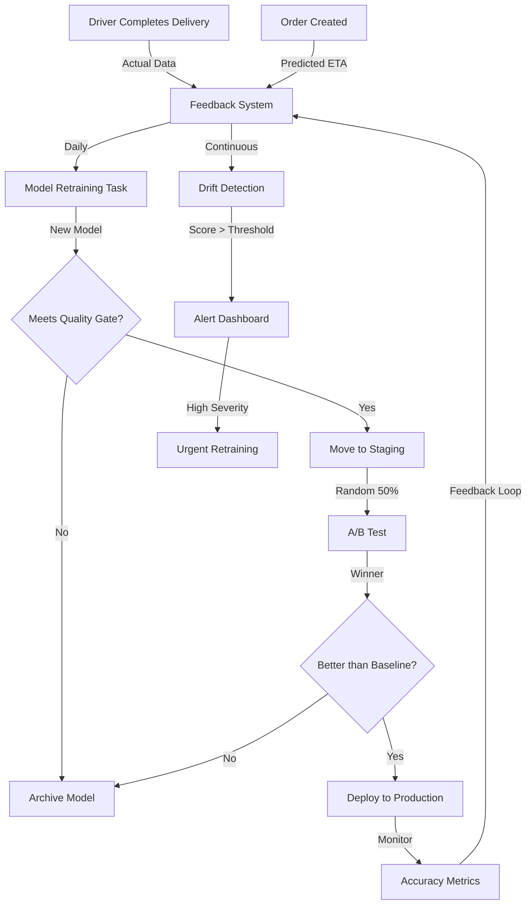

# IntelliLog-AI Learning System Architecture

## Overview

The Learning System enables IntelliLog-AI to continuously improve ETA predictions and route optimization through real delivery data, feedback loops, and automated model retraining. Models learn from ground truth (actual delivery times, driver behavior) and adapt to changing traffic patterns, weather, and operational constraints.

---

## 1. Core Concepts

### Feedback Loop
The system captures two data points for every delivery:
- **Predicted value** (made at order creation)
- **Actual value** (recorded at delivery completion)

The delta between them drives model improvement.

### Model Lifecycle
```
Training Data → Model Training → Staging Test → Drift Detection → A/B Test → Production → Monitoring → Retraining
```

---

## 2. Data Collection & Feedback

### 2.1 Delivery Outcome Tracking

**New Table: `DELIVERY_FEEDBACK`**
```sql
CREATE TABLE delivery_feedback (
    id UUID PRIMARY KEY,
    tenant_id UUID NOT NULL,
    order_id UUID NOT NULL,
    
    -- Predictions made at order creation
    predicted_eta_minutes INT,
    predicted_delivery_distance_km FLOAT,
    
    -- Ground truth recorded at completion
    actual_delivery_time_minutes INT,
    actual_delivery_distance_km FLOAT,
    successful BOOLEAN,
    
    -- Contextual features (for analysis)
    traffic_condition VARCHAR, -- 'light', 'medium', 'heavy'
    weather_condition VARCHAR,  -- 'clear', 'rain', 'snow'
    driver_id UUID,
    vehicle_type VARCHAR,
    
    -- Metadata
    prediction_model_version VARCHAR,
    created_at TIMESTAMP,
    completed_at TIMESTAMP,
    
    FOREIGN KEY (tenant_id) REFERENCES tenant(id),
    FOREIGN KEY (order_id) REFERENCES order(id),
    FOREIGN KEY (driver_id) REFERENCES driver(id)
);

-- Indexes for fast queries
CREATE INDEX idx_feedback_tenant_date ON delivery_feedback(tenant_id, completed_at);
CREATE INDEX idx_feedback_model_version ON delivery_feedback(prediction_model_version);
```

### 2.2 Model Performance Metrics

**New Table: `MODEL_METRICS`**
```sql
CREATE TABLE model_metrics (
    id UUID PRIMARY KEY,
    tenant_id UUID NOT NULL,
    model_version VARCHAR,
    model_type VARCHAR, -- 'eta', 'vrp'
    
    -- Performance metrics
    mae FLOAT,              -- Mean Absolute Error
    mape FLOAT,             -- Mean Absolute Percentage Error
    rmse FLOAT,             -- Root Mean Squared Error
    accuracy FLOAT,         -- Percentage within threshold
    
    -- Metadata
    total_predictions INT,
    evaluation_date TIMESTAMP,
    training_date TIMESTAMP,
    data_points_used INT,
    
    FOREIGN KEY (tenant_id) REFERENCES tenant(id)
);
```

### 2.3 Model Versions & Registry

**New Table: `MODEL_REGISTRY`**
```sql
CREATE TABLE model_registry (
    id UUID PRIMARY KEY,
    tenant_id UUID NOT NULL,
    model_name VARCHAR,     -- 'eta_prediction', 'vrp_optimizer'
    version VARCHAR,        -- 'v_20260208_120000'
    
    -- Model artifact location
    artifact_path VARCHAR,  -- 's3://bucket/models/eta/v_20260208_120000.pkl'
    artifact_checksum VARCHAR,
    
    -- Status
    status VARCHAR,         -- 'training', 'staging', 'production', 'deprecated'
    
    -- Performance baseline
    baseline_mae FLOAT,
    baseline_accuracy FLOAT,
    
    -- Metadata
    dependencies TEXT,
    created_at TIMESTAMP,
    promoted_at TIMESTAMP,
    metrics_id UUID,
    
    FOREIGN KEY (tenant_id) REFERENCES tenant(id),
    FOREIGN KEY (metrics_id) REFERENCES model_metrics(id)
);
```

### 2.4 Drift Detection Log

**New Table: `MODEL_DRIFT_EVENTS`**
```sql
CREATE TABLE model_drift_events (
    id UUID PRIMARY KEY,
    tenant_id UUID NOT NULL,
    model_version VARCHAR,
    
    -- Drift metrics
    data_drift_score FLOAT,        -- Difference in input data distribution
    performance_drop FLOAT,        -- % drop in accuracy
    detected_at TIMESTAMP,
    
    -- Alert metadata
    severity VARCHAR,              -- 'low', 'medium', 'high'
    action_taken VARCHAR,          -- 'retraining_scheduled', 'manual_review', 'auto_rollback'
    resolved BOOLEAN,
    
    FOREIGN KEY (tenant_id) REFERENCES tenant(id)
);
```

---

## 3. API Endpoints for Learning System

### 3.1 Feedback Submission

**Endpoint**: `POST /api/v1/learning/feedback`

**When called**: After driver marks delivery as complete

```json
{
  "order_id": "ORD-2026-001",
  "predicted_eta_minutes": 24,
  "actual_delivery_time_minutes": 23,
  "traffic_condition": "medium",
  "weather_condition": "clear",
  "vehicle_type": "bike",
  "successful": true,
  "prediction_model_version": "v_20260205_001854"
}
```

**Response**:
```json
{
  "feedback_id": "FEED-2026-001",
  "error_margin_minutes": -1,
  "accuracy_percentile": 92,
  "recorded_at": "2026-02-08T14:35:00Z"
}
```

### 3.2 Model Performance Dashboard

**Endpoint**: `GET /api/v1/learning/models/performance`

**Query params**: `model_type=eta`, `time_range=7d`, `tenant_id=xxx`

```json
{
  "current_model": {
    "version": "v_20260205_001854",
    "mae": 3.2,
    "mape": 8.5,
    "accuracy": 92,
    "total_predictions": 5420
  },
  "previous_model": {
    "version": "v_20260201_003000",
    "mae": 4.1,
    "mape": 10.2,
    "accuracy": 88,
    "total_predictions": 3200
  },
  "improvement": {
    "mae_reduction": "22%",
    "accuracy_gain": "+4%"
  },
  "drift_detected": false
}
```

### 3.3 Retraining Status

**Endpoint**: `GET /api/v1/learning/retraining/status`

```json
{
  "last_training_date": "2026-02-07T02:00:00Z",
  "next_scheduled_training": "2026-02-09T02:00:00Z",
  "training_frequency": "daily",
  
  "current_training_job": {
    "job_id": "TRAIN-2026-0042",
    "model_type": "eta",
    "status": "in_progress",
    "data_points": 15000,
    "progress": 65,
    "eta_completion": "2026-02-08T16:30:00Z"
  },
  
  "pending_models_in_staging": 1,
  "models_ready_for_ab_test": 0
}
```

### 3.4 A/B Test Results

**Endpoint**: `GET /api/v1/learning/ab-tests/{test_id}`

```json
{
  "test_id": "AB-2026-0015",
  "model_version_a": "v_20260205_001854",
  "model_version_b": "v_20260207_150000",
  
  "duration_days": 2,
  "total_deliveries": 3420,
  
  "version_a": {
    "mae": 3.2,
    "accuracy": 92.1,
    "conversion": "95.2%"
  },
  "version_b": {
    "mae": 2.9,
    "accuracy": 93.5,
    "conversion": "96.1%"
  },
  
  "winner": "version_b",
  "statistical_significance": 0.98,
  "recommendation": "promote_to_production"
}
```

---

## 4. Celery Learning Tasks

### 4.1 Daily Model Retraining

**Task**: `src/backend/worker/tasks.py`

```python
@celery_app.task(
    bind=True,
    autoretry_for=(Exception,),
    retry_kwargs={'max_retries': 3},
    retry_backoff=300
)
def retrain_eta_models(self, tenant_id: str, lookback_days: int = 30):
    """
    Daily task to retrain ETA prediction models.
    
    Triggers:
    - Celery Beat schedule (2 AM UTC)
    - Manual triggering via admin API
    """
    feedback = fetch_feedback_data(tenant_id, lookback_days)
    
    # Extract features from feedback
    features, labels = engineer_features(feedback)
    
    # Train new model
    new_model = train_xgboost(features, labels)
    
    # Evaluate
    metrics = evaluate_model(new_model, test_set)
    
    # Check for improvement
    if metrics['mae'] < baseline_mae * 1.05:  # Allow 5% degradation
        # Save to staging
        model_version = f"v_{datetime.now().strftime('%Y%m%d_%H%M%S')}"
        save_model_to_staging(new_model, model_version, metrics)
        
        # Schedule A/B test
        schedule_ab_test.delay(tenant_id, model_version)
    else:
        log_training_failure(tenant_id, metrics)
```

### 4.2 Drift Detection

**Task**: `src/backend/worker/tasks.py`

```python
@celery_app.task(
    bind=True,
    schedule=crontab(hour=6, minute=0)  # 6 AM UTC daily
)
def detect_model_drift(self, tenant_id: str):
    """
    Detect data drift and performance degradation.
    """
    recent_feedback = fetch_recent_feedback(tenant_id, days=7)
    
    # Statistical tests for data drift
    drift_score = calculate_data_drift(
        recent_feedback,
        historical_data
    )
    
    # Performance degradation check
    current_mae = calculate_mae(recent_feedback)
    perf_drop = (current_mae - baseline_mae) / baseline_mae
    
    if drift_score > 0.3 or perf_drop > 0.15:
        create_drift_alert(
            tenant_id=tenant_id,
            severity='high' if perf_drop > 0.2 else 'medium',
            drift_score=drift_score,
            action='trigger_retraining'
        )
        
        # Auto-trigger urgent retraining
        retrain_eta_models.delay(tenant_id, lookback_days=60)
```

### 4.3 A/B Testing

**Task**: `src/backend/worker/tasks.py`

```python
@celery_app.task(bind=True)
def run_ab_test(self, tenant_id: str, staged_model_version: str, duration_hours: int = 48):
    """
    Run A/B test on staged model.
    
    - 50% traffic to baseline (production model)
    - 50% traffic to candidate (staged model)
    - Collect metrics for statistical comparison
    """
    test_id = create_test_record(tenant_id, staged_model_version)
    
    # Run A/B test for specified duration
    sleep(duration_hours * 3600)
    
    # Compare results
    results = compare_model_performance(
        baseline_version=get_production_model(),
        candidate_version=staged_model_version,
        test_id=test_id
    )
    
    if results['statistical_significance'] > 0.95:
        if results['candidate_mae'] < results['baseline_mae']:
            # Promote to production
            promote_model_to_production(staged_model_version, tenant_id)
            notify_admin('success', results)
        else:
            # Keep baseline
            archive_model(staged_model_version)
            notify_admin('no_improvement', results)
    else:
        # Extend test or schedule another run
        re_schedule_ab_test(tenant_id, staged_model_version)
```

---

## 5. Learning System Architecture Diagram



---

## 6. Configuration & Scheduling

### 6.1 Celery Beat Configuration

**File**: `src/backend/worker/celery_app.py`

```python
from celery.schedules import crontab

app.conf.beat_schedule = {
    'retrain-eta-daily': {
        'task': 'src.backend.worker.tasks.retrain_eta_models',
        'schedule': crontab(hour=2, minute=0),  # 2 AM UTC
        'kwargs': {'lookback_days': 30}
    },
    'detect-drift-daily': {
        'task': 'src.backend.worker.tasks.detect_model_drift',
        'schedule': crontab(hour=6, minute=0),  # 6 AM UTC
        'kwargs': {}
    },
    'check-staging-models': {
        'task': 'src.backend.worker.tasks.check_staging_models',
        'schedule': crontab(hour='*/6'),  # Every 6 hours
    }
}
```

### 6.2 Learning System Settings

**File**: `src/backend/core/config.py`

```python
class LearningSystemConfig(BaseSettings):
    # Model Quality Gates
    ACCEPTABLE_MAE_DEGRADATION: float = 0.05  # 5%
    ACCEPTABLE_ACCURACY_DROP: float = 0.02     # 2%
    
    # Drift Detection Thresholds
    DRIFT_SCORE_THRESHOLD: float = 0.3
    PERFORMANCE_DROP_THRESHOLD: float = 0.15
    
    # A/B Testing
    AB_TEST_DURATION_HOURS: int = 48
    AB_TEST_SIGNIFICANCE_LEVEL: float = 0.95
    AB_TEST_SPLIT: float = 0.5  # 50/50
    
    # Retraining
    MIN_DATA_POINTS_FOR_TRAINING: int = 1000
    RETRAINING_LOOKBACK_DAYS: int = 30
    SCHEDULED_TRAINING_HOUR: int = 2  # UTC
    
    # Model Registry
    MODEL_ARTIFACT_STORAGE: str = 's3://intellog-models'
    MAX_STAGING_MODELS: int = 3
    MAX_MODEL_VERSIONS_KEPT: int = 10
```

---

## 7. Monitoring & Alerts

### 7.1 Metrics to Track

| Metric | Threshold | Action |
|--------|-----------|--------|
| Model MAE | > baseline + 5% | Trigger retraining |
| Prediction Accuracy | < 90% | Alert team |
| Data Drift Score | > 0.3 | Investigate root cause |
| Model Age | > 7 days | Schedule retraining |
| A/B Test Significance | > 0.95 | Promote winner |

### 7.2 Dashboard Views (in Frontend)

- **Model Performance Trends** — MAE, MAPE, accuracy over time
- **Prediction Accuracy Distribution** — % within 5min, 10min, 15min
- **Drift Alerts** — Real-time drift detection status
- **A/B Test Results** — Active and completed tests with winners
- **Retraining Schedule** — Next scheduled retraining and historical runs

---

## 8. Implementation Roadmap

### Phase 1: Foundation (Week 1-2)
- [ ] Create feedback tables and APIs
- [ ] Implement feedback submission after delivery
- [ ] Build model performance tracking dashboard

### Phase 2: Automation (Week 3-4)
- [ ] Set up Celery retraining tasks
- [ ] Implement basic drift detection
- [ ] Create model registry and versioning

### Phase 3: Intelligence (Week 5-6)
- [ ] A/B testing framework
- [ ] Advanced drift detection with statistical tests
- [ ] Auto-rollback on catastrophic failure

### Phase 4: Optimization (Week 7+)
- [ ] Hyperparameter tuning via Bayesian search
- [ ] Multi-model ensembles
- [ ] Context-aware models per region/vehicle type

---

## 9. Success Metrics

After implementing the learning system:
- **ETA Accuracy**: Improve from 92% to 95%+ within 90 days
- **Model Age**: Never stale (< 36 hours old)
- **Retraining Time**: < 2 hours for full dataset
- **A/B Test Winners**: 70%+ of new models beat baseline
- **Drift Detection**: < 1 hour MTTR (mean time to recovery)
