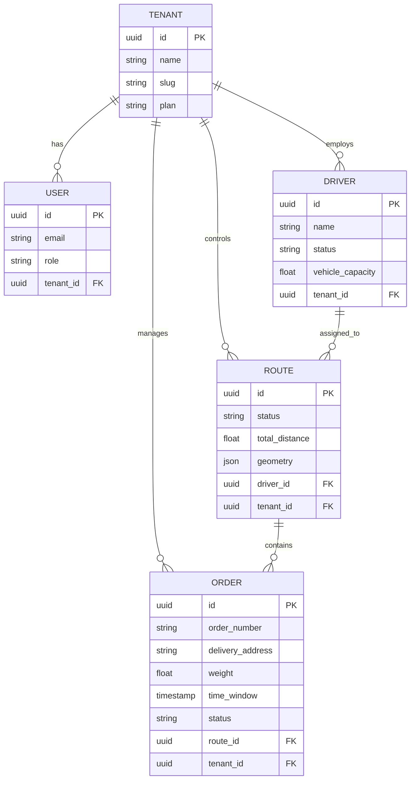

# IntelliLog-AI System Architecture

## 1. Executive Summary

IntelliLog-AI is an enterprise-grade SaaS platform designed for intelligent logistics management. It leverages AI/ML to optimize delivery routes, predict estimated times of arrival (ETA), and manage fleet operations in real-time. The system is built on a microservices-ready architecture using **FastAPI** for high-performance backend processing and **React** for a responsive, modern frontend experience.

## 2. High-Level Architecture

The system follows a layered architecture pattern, separating concerns between the client presentation, API services, business logic, and data persistence layers.

```mermaid
graph TD
    User[User / Client] -->|HTTPS| CDN[CDN / Load Balancer]
    CDN -->|Static Assets| FE[Frontend (React + Vite)]
    CDN -->|API Requests| API[Backend API (FastAPI)]
    
    subgraph "Backend Services"
        API -->|Auth & User Mgmt| Auth[Auth Service]
        API -->|Business Logic| SVC[Core Services]
        API -->|Async Tasks| Worker[Celery Worker]
        
        SVC -->|Read/Write| DB[(PostgreSQL)]
        SVC -->|Cache/Queue| Redis[(Redis)]
        
        Worker -->|ML Inference| ML[ML Models (XGBoost)]
        Worker -->|Optimization| OR[OR-Tools Engine]
    end
    
    subgraph "External Integrations"
        Maps[Map Services (OSRM/Google Maps)]
    end
    
    SVC --> Maps
```

## 3. Technology Stack

### Frontend
- **Framework**: React 18 with TypeScript
- **Build Tool**: Vite
- **Styling**: Tailwind CSS + Shadcn/UI for component library
- **State Management**: React Hooks (Context API)
- **Maps**: Leaflet / React-Leaflet
- **HTTP Client**: Axios

### Backend
- **Framework**: FastAPI (Python 3.10+)
- **ORM**: SQLAlchemy (Async)
- **Schema Validation**: Pydantic v2
- **Authentication**: OAuth2 with JWT (JSON Web Tokens)
- **Task Queue**: Celery (implied structure)
- **ML Libraries**: Scikit-Learn, XGBoost, NumPy, Pandas
- **Optimization**: Google OR-Tools

### Infrastructure & Data
- **Database**: PostgreSQL 15+
- **Caching & Broker**: Redis
- **Containerization**: Docker & Docker Compose
- **Web Server**: Nginx (via Docker)

## 4. Key Components

### 4.1 Backend Modules (`src/backend`)
- **API Engine**: `app/main.py` initializes the FastAPI app, middlewares (CORS, TrustedHost), and routers.
- **Routers (`api/v1`)**:
    - `/auth`: Login, Registration, Token management.
    - `/tenants`: Multi-tenancy support (SaaS core).
    - `/orders`: Order ingestion and management.
    - `/drivers`: Fleet management.
    - `/routes`: Optimization endpoints.
- **Core Services (`app/services`)**: Business logic implementation independent of the HTTP transport layer.
    - `eta_service.py`: Handling ETA calculations.
- **Database Models (`app/db`)**: SQLAlchemy models defining the schema.

### 4.2 Frontend Modules (`src/frontend`)
- **Pages**:
    - `RouteOptimizer`: Main interface for uploading CSVs and visualizing optimized routes.
    - `FleetControl`: Real-time driver tracking and management.
    - `AnalyticsManagement`: Business intelligence dashboards.
- **Components**: Reusable UI blocks (Cards, Buttons, Inputs) built with accessibility in mind.
- **Context/Hooks**: Custom hooks for Toast notifications, API integration.

### 4.3 AI & Optimization Engine
- **Route Optimization**: Uses **Google OR-Tools** to solve Vehicle Routing Problems (VRP). Constraints include:
    - Vehicle capacity (weight/volume).
    - Time windows for delivery.
    - Driver shifts.
- **ETA Prediction**: Uses **XGBoost** regression models trained on historical delivery data to predict accurate arrival times based on distance, traffic (simulated), and load.

## 5. Database Schema

The database is designed with multi-tenancy at its core. Most entities interact with a `Tenant` ID.



## 6. Security Architecture
- **Authentication**: Stateless JWT authentication. Access tokens are short-lived.
- **Authorization**: Role-based access control (RBAC) implemented via User roles (Admin, Manager, Dispatcher).
- **Data Isolation**: Logical separation of tenant data via `tenant_id` foreign keys enforced at the service layer.
- **Input Validation**: Strict validation using Pydantic models to prevent injection attacks and ensure data integrity.

## 7. Deployment & DevOps
- **Docker Compose**: Orchestrates the multi-container environment (Frontend, Backend, DB, Redis).
- **Environment Configuration**: `config.py` uses `pydantic-settings` to load configuration from `.env` files.
- **Logging**: Centralized structured logging.
